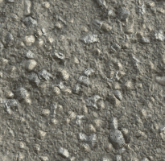

# Moss Weathering

<table>
<tr style="border: 0;">
<td style="border: 0;" valign="top">

{width="128px"}

## Moss Weathering

**In:** *Mesh Based Generators**/Weathering*

**Complex**

</td>
<td style="border: 0;" valign="top">

## Description

This is a full-material effect that works on multiple channels at once. It generates an overgrown moss effect, with a single control for Propagation.

This effect works best with a baked World Space Position map and an additional Heightmap. While this is not an exact requirement, it lends the effect more credible placement.

Make sure to properly understand the [Link Creation Modes](https://support.allegorithmic.com/documentation/display/SD5/Link+Creation+Modes) when working with full materials.

## Parameters

### Inputs

* **Position**: *Color Input*   
  Baked World Space Position.
* **Height** : *Grayscale Input*   
  Additional Heightmap input.
* **Mask** : *Grayscale Input*   
  Mask slot used for masking the node's effects. Can be toggled with the "Mask" parameter.

### Parameters

* **Channels**   
  * Toggle material channels on and off in this group, for example when using Specular/Glossiness maps instead of Metallic/Roughness.
* **Advanced**   
  * **Normal Format**: *DirectX, OpenGL*  
    Switches between different Normalmap formats (inverts the green channel).
  * **Mask**: *False/True*  
    Toggles the use of the Mask map on or off.
* **Effect**   
  * **Moss Propagation**: *0.0 - 1.0*Sets the spread of the moss. Grows in steps from slight coverage to heavy, thick, dark moss.
* **Blending**   
  * **Diffuse Intensity**: *0.0 - 1.0*  
    Blending strength of the Diffuse.
  * **Base Color Intensity**: *0.0 - 1.0*  
    Blending strength of the Base Color.
  * **Normal Intensity**: *0.0 - 1.0*  
    Blending strength of the Normal.
  * **Specular Intensity**: *0.0 - 1.0*  
    Blending strength of the Specular.
  * **Glossiness Intensity**: *0.0 - 1.0*  
    Blending strength of the Glossiness.
  * **Roughness Intensity**: *0.0 - 1.0*  
    Blending strength of the Roughness.
  * **Ambient Occlusion Intensity**: *0.0 - 1.0*  
    Blending strength of the Ambient Occlusion.
  * **Height Intensity**: *0.0 - 1.0*  
    Blending strength of the Height.

## Example Images

</td>
</tr>
</table>
