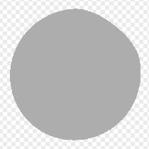

# Rock Weathering

<table>
<tr style="border: 0;">
<td width="33.33%" style="border: 0;" valign="top">

{width="128px"}

<b>In:</b> Mesh Based Generators &gt; Weathering

</td>
<td width="100.00%" style="border: 0;" valign="top">

## Description

</td>
</tr>
</table>

## Inputs

|  |  |
|:---|:---|
| <b>Ambient Occlusion</b> <i>Grayscale Input</i> | Baked map used for internal effects and masking. |
| <b>Curvature</b> <i>Grayscale Input</i> | Baked map used for internal effects and masking. |
| <b>Normal WS</b> <i>Color Input</i> | Baked World Space Normalmap used for internal effects and masking. |
| <b>Mask</b> <i>Grayscale Input</i> | Mask slot used for masking the node's effects. Can be toggled with the "Mask" parameter. |

## Parameters

|  |  |
|:---|:---|
| <b>Channels</b> | Toggle material channels on and off in this group, for example when using Specular/Glossiness maps instead of Metallic/Roughness. |
| <b>Advanced</b> |  |
| <b>Normal Format</b> <i>DirectX, OpenGL</i> | Switches between different Normalmap formats (inverts the green channel). |
| <b>Mask</b> <i>False/True</i> | Toggles the use of the Mask map on or off. |
| <b>Effect</b> |  |
| <b>Dust</b> <i>0.0 - 1.0</i> |  |
| <b>Dirtiness</b> <i>0.0 - 1.0</i> |  |
| <b>Edges Wearing</b> <i>0.0 - 1.0</i> |  |
| <b>Used Rock</b> <i>0.0 - 1.0</i> |  |
| <b>Cracks Scale</b> <i>1.0 - 60.0</i> |  |
| <b>Cracks Intensity</b> <i>0.0 - 1.0</i> |  |
| <b>Age</b> <i>0.0 - 1.0</i> |  |
| <b>Age Threshlod</b> <i>0.0 - 1.0</i> |  |
| <b>Sharp Edges Scratches Scale</b> <i>1.0 - 32.0</i> |  |
| <b>Sharp Edges Scratches Warp Intensity</b> <i>0.0 - 1.0</i> |  |
| <b>Used Rock Desaturation</b> <i>0.0 - 1.0</i> |  |
| <b>Used Rock Brightness</b> <i>0.0 - 1.0</i> |  |
| <b>Blending</b> |  |
| <b>Diffuse Intensity</b> <i>0.0 - 1.0</i> | Blending strength of the Diffuse. |
| <b>Base Color Intensity</b> <i>0.0 - 1.0</i> | Blending strength of the Base Color. |
| <b>Normal Intensity</b> <i>0.0 - 64.0</i> | Blending strength of the Normal. |
| <b>Specular Intensity</b> <i>0.0 - 1.0</i> | Blending strength of the Specular. |
| <b>Glossiness Intensity</b> <i>0.0 - 1.0</i> | Blending strength of the Glossiness. |
| <b>Roughness Intensity</b> <i>0.0 - 1.0</i> | Blending strength of the Roughness. |
| <b>Ambient Occlusion Intensity</b> <i>0.0 - 1.0</i> | Blending strength of the Ambient Occlusion. |
| <b>Height Intensity</b> <i>0.0 - 1.0</i> | Blending strength of the Height. |

## Examples

<table style="margin-top: 32px; margin-bottom: 32px">
    <tr style="border: 0">
        <td style="border: 0; background: transparent">
            
        </td>
    </tr>
</table>
