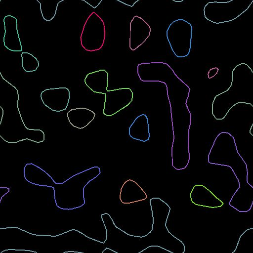

# Paths to Spline

<table>
<tr style="border: 0;">
<td width="33.33%" style="border: 0;" valign="top">

<b>In:</b> Spline &amp; Path Tools &gt; Path Tools

</td>
<td width="100.00%" style="border: 0;" valign="top">

## Description

Converts a paths into splines which can be visualized using a [Spline Render](../../../../../../compositing-graphs/nodes-reference-for-com/node-library/spline-paths-tools/spline-tools/spline-render/spline-render.md) node and processed using [Spline nodes](../../../../../../compositing-graphs/nodes-reference-for-com/node-library/spline-paths-tools/spline-tools/spline-tools.md).

</td>
</tr>
</table>

>[!NOTE]
>
> Splines are curves thus cannot retain the sharpness of paths. Expect some smoothing of shapes when converting paths into splines.

>[!TIP]
>
> This node can be used after the [Mask to Paths](../../../../../../compositing-graphs/nodes-reference-for-com/node-library/spline-paths-tools/path-tools/mask-to-paths/mask-to-paths.md) node to form a chain that converts a mask into splines.

## Inputs

|  |  |
|:---|:---|
| <b>Paths</b> <i>Color</i> | A list of encoded segments paths. Connect this input to the result of a [Mask to Paths](../../../../../../compositing-graphs/nodes-reference-for-com/node-library/spline-paths-tools/path-tools/mask-to-paths/mask-to-paths.md) or to another Path-processing node. |

## Outputs

|  |  |
|:---|:---|
| <b>Spline Coords</b> <i>Color</i> | The coordinates of the input splines’ points encoded in the RGBA channels of a color image: <b>R</b> - X position <b>G</b> - Y position <b>B</b> - Height <b>A</b> - Packed data: &nbsp;&nbsp;&nbsp;&nbsp;* Sign: Spline is closed (negative) or open (positive); &nbsp;&nbsp;&nbsp;&nbsp;* Absolute value: Thickness + 1. |
| <b>Spline Data</b> <i>Color</i> | Additional data of the input splines encoded in the RGBA channels of a <b>color</b> image: <b>R</b> - Tangents X <b>G</b> - Tangents Y <b>B</b> - Unused <b>A</b> - Unused |
| <b>Spline Amount</b> <i>Integer</i> | The number of input splines. |

## Parameters

|  |  |
|:---|:---|
| <b>Splines Precision</b> <i>Integer</i> | The base-2 logarithm (log2) of the number of vertices sampled in each path of the Paths input to build the corresponding spline. |

## Examples

<table>
<tr style="border: 0;">
<td style="border: 0;" valign="top">

<table>
  <tr>
    <td>
      
       <i>Before</i>
    </td>
    <td>
      
       <i>After</i>
    </td>
  </tr>
</table>

</td>
<td style="border: 0;" valign="top">

<table>
  <tr>
    <td>
      
       <i>Before</i>
    </td>
    <td>
      
       <i>After</i>
    </td>
  </tr>
</table>

</td>
</tr>
</table>
