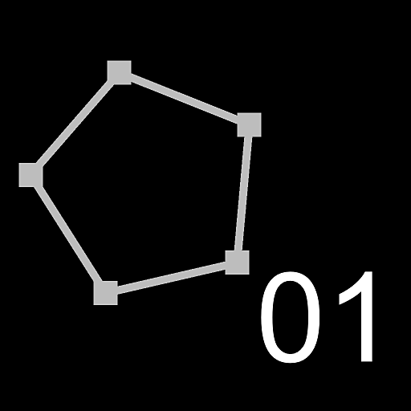
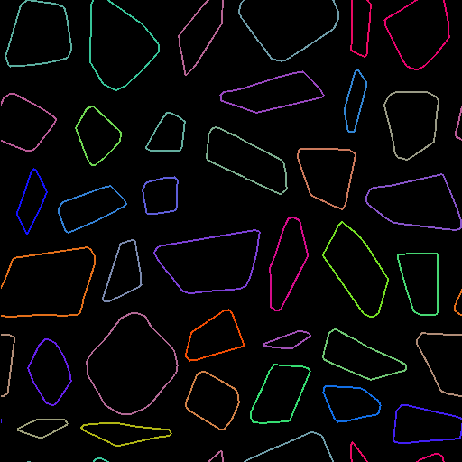

# Paths Vertex Processor Simple

<table>
<tr style="border: 0;">
<td width="33.33%" style="border: 0;" valign="top">

<b>In:</b> Spline &amp; Path Tools &gt; Path Tools

</td>
<td width="100.00%" style="border: 0;" valign="top">

## Description

Applies a transformation on the vertices position of the input <b>Paths</b>.

1. Edit the <b>Per Vertex Function</b> parameter function;
1. Use a <b>Get Float2</b> node the *vertex.pos* variable;
1. Do some operations on this value (E.g., multiply it to scale the paths);
1. Set the result of your computation as output.

</td>
</tr>
</table>

You may use input images and sample them from the function. You must first connect an input to able to sample it from the function. (Be careful, first input is *Image 1*!)  
You can also access the *vertex.corner* (bool) and *path.id* (float) variables.

>[!TIP]
>
> For advanced users, the [Paths Format Specification](../paths-format-spe/paths-format-specifications.md) explains how the data of paths is encoded into color images, and provides tips for manipulating this data directly.

>[!NOTE]
>
> See also [Paths Vertex Processor](../paths-vertex-processor/paths-vertex-processor.md).

## Input connectors

<b>Paths</b> *Color*  
A list of encoded segments paths. Connect this input to the result of a [Mask to Paths](../mask-to-paths/mask-to-paths.md) or to another Path-processing node.

<b>Input &#35;</b> *Color/Grayscale*  
Inputs for images that should be sampled in the <b>Per Vertex Function</b> parameter function.

## Output connectors

<b>Paths</b> *Color*  
The transformed Paths. You can either use [Preview Paths](../preview-paths/preview-paths.md) to get an idea of what the result represents, use another Paths-processing node, or input it to a [Paths to Spline](../paths-to-spline/paths-to-spline.md) to further process it as Splines.

## Parameters

<b>Image Input Count</b> *Integer*The number of visible <b>Input &#35;</b> input connectors to connect images that should be sampled in the <b>Per Vertex Function</b> parameter function.  
Once you are done setting up all the desired samples, you can hide unused pins by reducing this parameter's value back to 0.  
If you need more inputs, use the [Paths Vertex Processor](../paths-vertex-processor/paths-vertex-processor.md) instead.

<b>Per Vertex Function</b> *Float2*  
Function applied for each vertex. Must return the new vertex position.  
See the <b>Description</b> section in this page for guidance.

## Examples

<table>
<tr style="border: 0;">
<td style="border: 0;" valign="top">

</td>
<td style="border: 0;" valign="top">

</td>
</tr>
</table>
