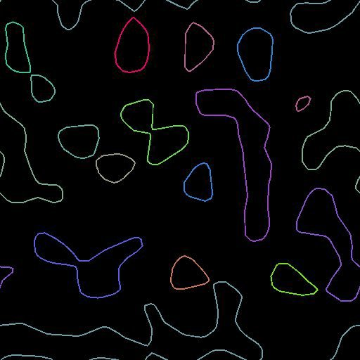

# Preview Paths

<table>
<tr style="border: 0;">
<td width="33.33%" style="border: 0;" valign="top">

<b>In:</b> Spline &amp; Path Tools &gt; Path Tools

</td>
<td width="100.00%" style="border: 0;" valign="top">

## Description

Trace segments and vertices of the path on top of the given background. One random color per path.

You'll get a similar result as the <b>Preview</b> output of the [Mask to Paths](../../../../../../help/compositing-graphs/nodes-reference-for-com/node-library/spline-paths-tools/path-tools/mask-to-paths/mask-to-paths.md) but with more options.

</td>
</tr>
</table>

## Input connectors

<b>Background</b> *Color*  
A background image on top of with display the path. This also controls the rendering size.

<b>Paths</b> *Color*  
A list of encoded segments paths. Connect this input to the result of a [Mask to Paths](../../../../../../help/compositing-graphs/nodes-reference-for-com/node-library/spline-paths-tools/path-tools/mask-to-paths/mask-to-paths.md) or to another Path-processing node.

## Parameters

<b>Show Corners</b> *Boolean*  
Displays a square on each vertex that is marked as corner (additive blending).

<b>Show Vertices</b> *Boolean*  
Displays a circular shape on each vertex (additive blending). Corners are still displayed as squares.

<b>Segments Thickness (px)</b> *Float*  
Adjusts the thickness of rendered segments in pixels.

## Examples

<table>
<tr style="border: 0;">
<td style="border: 0;" valign="top">

</td>
<td style="border: 0;" valign="top">

</td>
</tr>
</table>
