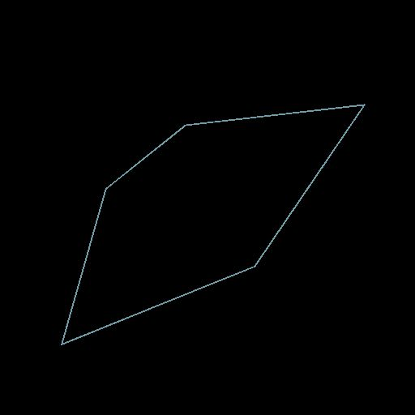

# Quad Transform on Path

<table>
<tr style="border: 0;">
<td width="33.33%" style="border: 0;" valign="top">

<b>In:</b> Spline &amp; Path Tools &gt; Path Tools

</td>
<td width="100.00%" style="border: 0;" valign="top">

## Description

Deform a Paths using 4 handles.

</td>
</tr>
</table>

## Input connectors

<b>Paths</b> *Color*  
A list of encoded segments paths. Connect this input to the result of a [Mask to Paths](../../../../../../compositing-graphs/nodes-reference-for-com/node-library/spline-paths-tools/path-tools/mask-to-paths/mask-to-paths.md) or to another *Path*-processing node.

## Output connectors

<b>Paths</b> *Color*  
The transformed Paths. You can either use [Preview Paths](../../../../../../compositing-graphs/nodes-reference-for-com/node-library/spline-paths-tools/path-tools/preview-paths/preview-paths.md) to get an idea of what the result represents, use another Paths-processing node, or input it to a [Paths to Spline](../../../../../../compositing-graphs/nodes-reference-for-com/node-library/spline-paths-tools/path-tools/paths-to-spline/paths-to-spline.md) to further process it as Splines.

## Parameters

<b>p00</b> *Float2*  
The position of the top-left handle.

<b>p01</b> *Float2*  
The position of the top-right handle.

<b>p02</b> *Float2*  
The position of the bottom-left handle.

<b>p03</b> *Float2*  
The position of the bottom-right handle.

## Examples

<table>
<tr style="border: 0;">
<td style="border: 0;" valign="top">

<table>
  <tr>
    <td>
      
       <i>Before</i>
    </td>
    <td>
      
       <i>After</i>
    </td>
  </tr>
</table>

</td>
<td style="border: 0;" valign="top">

<table>
  <tr>
    <td>
      
       <i>Before</i>
    </td>
    <td>
      
       <i>After</i>
    </td>
  </tr>
</table>

</td>
</tr>
</table>

<table>
<tr style="border: 0;">
<td style="border: 0;" valign="top">

</td>
<td style="border: 0;" valign="top">

</td>
</tr>
</table>
