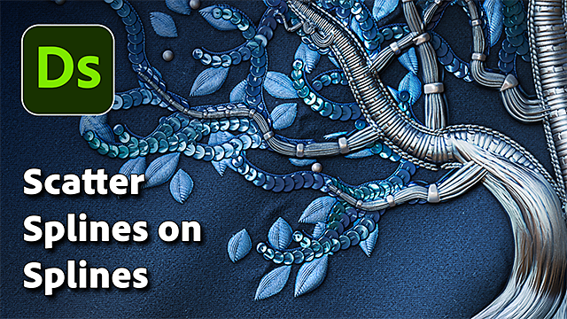
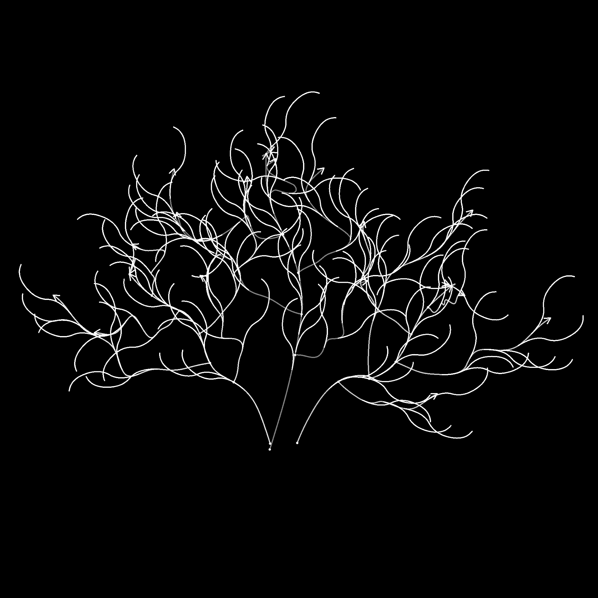
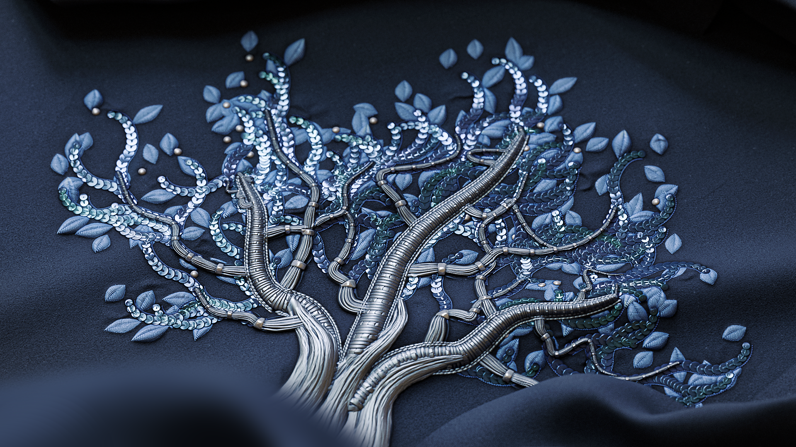

# Scatter Splines on Splines

<table>
<tr style="border: 0;">
<td width="33.33%" style="border: 0;" valign="top">

<b>In:</b> Spline &amp; Path Tools &gt; Spline Tools

</td>
<td width="100.00%" style="border: 0;" valign="top">

## Description

Places splines along the input parent splines.

The node offers deep customization options for controlling how splines are scattered, and lets you scatter simple straight splines, or your own custom splines.

The node lets you create intricate structures for mapping colors and images using the [Spline Mapper](../spline-mapper-grayscale/spline-mapper-grayscale.md) nodes, or used as a skeleton for placing shapes using the [Scatter on Spline](../scatter-spline-grayscale/scatter-on-spline-grayscale.md) nodes.

</td>
</tr>
</table>

<table>
<tr style="border: 0;">
<td style="border: 0;" valign="top">

### Tutorial

Click the image on the right to access our <b>dedicated tutorial</b>, for a guided tour of the node's capabilities and its usage in the context of a Spline-based workflow.

</td>
<td style="border: 0;" valign="top">

</td>
</tr>
</table>

## Input connectors

|  |  |
| --- | --- |
| <b>Preview</b> *Grayscale* | The preview of the input splines as a grayscale image. |
| <b>Spline Coords</b> *Color* | The coordinates of the parent splines’ points encoded in the RGBA channels of a color image:  <b>R</b> - X position  <b>G</b> - Y position  <b>B</b> - Height  <b>A</b> - Packed data:          - Sign: Spline is closed (negative) or open (positive)          - Absolute value: Thickness + 1 |
| <b>Spline Data</b> *Color* | Additional data of the parent splines encoded in the RGBA channels of a color image:  <b>R</b> - Tangents X  <b>G</b> - Tangents Y  <b>B</b> - Tangents Z  <b>A</b> - Unused |
| <b>Spline Amount</b> *Integer* | The number of parent splines. |
| <b>Custom Spline Coords</b> *Color* | The coordinates of the custom splines’ points encoded in the RGBA channels of a color image:  <b>R</b> - X position  <b>G</b> - Y position  <b>B</b> - Height  <b>A</b> - Packed data:          - Sign: Spline is closed (negative) or open (positive)          - Absolute value: Thickness + 1 |
| <b>Custom Spline Data</b> *Color* | Additional data of the custom splines encoded in the RGBA channels of a color image:  <b>R</b> - Tangents X  <b>G</b> - Tangents Y  <b>B</b> - Tangents Z  <b>A</b> - Unused |
| <b>Custom Spline Amount</b> *Integer* | The number of custom splines. |
| <b>Scale Map</b> *Grayscale* | The grayscale map controlling the scale of the scattered splines.  The effect of this map is controlled by the <b>Scale Map Input Multiplier</b> parameter and is combined with the other parameters in the <b>Size</b> group. |
| <b>Rotation Map</b> *Grayscale* | The grayscale map controlling the rotation of the scattered splines.  The effect of this map is controlled by the <b>Rotation Map Input Multiplier</b> parameter and is combined with the other parameters in the <b>Rotation</b> group. |

## Output connectors

|  |  |
| --- | --- |
| <b>Preview</b> *Grayscale* | The preview of the scattered splines as a grayscale image. |
| <b>Spline Coords</b> *Color* | The coordinates of the scattered splines’ points encoded in the RGBA channels of a color image:  <b>R</b> - X position  <b>G</b> - Y position  <b>B</b> - Height  <b>A</b> - Packed data:          - Sign: Spline is closed (negative) or open (positive)          - Absolute value: Thickness + 1 |
| <b>Spline Data</b> *Color* | Additional data of the scattered splines encoded in the RGBA channels of a color image:  <b>R</b> - Tangents X  <b>G</b> - Tangents Y  <b>B</b> - Unused <b>A</b> - Unused |
| <b>Spline Amount</b> *Integer* | The number of scattered splines. |

## Parameters

|  |  |
| --- | --- |
| <b>Side</b> *Integer* | Controls on which side(s) of the parent splines the splines should be scattered, considering that 'forward' is the direction of the *parent* splines:   Left Place the splines on the left side.   Right Place the splines on the right side.   Left + Right Place the splines on both sides.   Left / Right - Alternate Place splines left then right alternatively (E.g., every other side).   Left / Right - Random Pick the side randomly for each spline. |
| <b>Amount Mode</b> *Integer* | The method of scattering the splines along the parent splines, which impacts the amount of scattered splines on each parent spline:   Fixed amount per spline The specified amount of evenly spaced splines is scattered.   Spacing The amount of splines is automatically adjusted to fit the specified even spacing.   In both cases, the first and last scattered splines fall exactly on the start and end of each parent spline respectively. |
| <b>Spline Amount Per Spline</b> *Integer* | The amount of evenly spaced splines scattered along each parent spline. |
| <b>Spline Spacing</b> *Float* | The minimum distance along parent splines by which splines should be spaced, while still landing the first and last spline on the start and end of each parent spline respectively. |
| <b>Spline Type</b> *Integer* | Selects which type of spline should be scattered on the parent splines:   Straight A simple, straight spline.   Custom spline The spline(s) provided to the <b>Custom Spline</b> inputs. Mutliple splines are supported when appended together into a list. |
| <b>Custom Spline Selection</b> *Integer* | When using multiple custom splines appended together into a list, this parameter lets you select how these splines should be distributed in the scattering.   Whole list All splines are scattered together as a group.   Sequential Each individual spline is scattered in order, looping around the list.   Random A random spline is picked from the list for every spline scattered. |
| <b>Start</b> *Float* | Offsets the point from the start of the parent splines where the scattering starts.  The value is the normalized length of each parent spline. |
| <b>End</b> *Float* | Offsets the point from the start of the parent splines where the scattering ends.  The value is the normalized length of each parent spline. |
| <b>Flip Direction</b> *Boolean* | Inverts the direction of the scattered splines. |
| <b>Left / Right Symmetry Mode</b> *Integer* | The method of symmetry applied to the splines scattered on each side of the parent splines.   Disabled No symmetry is applied, the splines are place on each side using a simple rotation.   Left symmetry The spline on the left is symmetrical to the one on the right relatively to the parent spline.   Right symmetry The spline on the right is symmetrical to the one on the left relatively to the parent spline. |
| <b>Left / Right Random Link</b> *Boolean* | Controls whether the splines on each side of the parent spline should use the same values when using random rotation, random scaling, etc. In other words:   *- False:* each spline uses separate random values  *- True:* both splines share the same random values |
| <b>Spline Pivot Mode</b> *Integer* | Sets the method of placing the pivot of scattered splines, which impacts rotation and scaling.   Note that the pivot is *always placed on the parent spline* and its controls impact the scattered spline. In other words: the pivot does not move, it is the scattered spline that moves and scales relatively to it.   Position along spline Move the pivot along the scattered spline.   Absolute position Set an arbitrary position for the pivot. |
| <b>Pivot Position Along Spline</b> *Float* | The normalized position of the pivot along the scattered spline, where 0 is its start and 1 is its end.   Note that the pivot follows the *direction* of the scattered spline and the spline's orientation may change to preserve the pivot's position and rotation relatively to the parent spline. |
| <b>Pivot Absolute Position</b> *Float2* | The position in UV space of the pivot. |
| <b>Non-Square Correction</b> *Boolean* | Adjust the splines positions and thickness to retain the their shape in non-square resolutions.   *Note:* When using custom splines, the custom spline should use the *same image ratio* as the <b>Scatter Splines on Splines</b> nodes. |

+++Size

|  |  |
| --- | --- |
| <b>Spline Scale</b> *Float* | A global control for the size of all splines, where 1 is their full original size.   Scaling is applied relatively to a spline’s pivot. The pivot position can be offset using the <b>Spline Pivot</b> parameter. |
| <b>Spline Scale Random</b> *Float* | Applies a random multiplier up to the specified value for decreasing the size of the splines. |
| <b>Scale Map Input Multiplier</b> *Float* | Controls the intensity of the <b>Scale Map</b> input. This map acts as a multiplier for the current size of the patterns.   The effect of this map is combined with the other parameters in the <b>Size</b> group. |
| <b>Scale Map Input Sampling Mode</b> *Integer* | The method of mapping the values in the <b>Scale Map</b> to the splines:   Texture space  The values are applied to the splines where they would be if placed in a texture using the texture’s UV coordinates. This effectively applies the value to the splines ‘in place’   Horizontal along spline The values are applied to the encoded splines’ coordinates directly (see <b>Spline Coords</b> input), where each row is applied to a different spline from top to bottom   Hor. along spline (rand. offset X) The values are applied to the encoded splines’ coordinates directly (see <b>Spline Coords</b> input), with a random horizontal offset in the <b>Scale Map</b> for each spline (I.e., each row in <b>Spline Coords</b>)   Hor. along spline (rand. offset Y) The values are applied to the encoded splines’ coordinates directly (see <b>Spline Coords</b> input), with a random vertical offset in the <b>Scale Map</b> for each spline (I.e., each row in <b>Spline Coords</b>) |
| <b>Start/End Attenuation</b> *Float2* | Factors in the distance from the midpoint of the spline to its <b>Start</b> and <b>End</b> when scaling the splines.   This means size is decreased for splines closer to a spline’s extremities. |

+++

+++Position

|  |  |
| --- | --- |
| <b>Local Offset</b> *Float2* | Applies an offset to the splines’ positions along the parent spline’s tangent (parallel) and normal (perpendicular). |
| <b>Offset on Spline Range</b> *Integer* | Sets the range of offset applied to the scattered splines along the parent splines.   Interval The range spans the interval *between* each scattered spline.   Parent spline The range spans the *full length* of the parent spline. |
| <b>Offset on Spline</b> *Float* | Applies a position offset to the splines along the parent splines. |
| <b>Random Offset Range</b> *Integer* | Sets the range of random offset applied to the scattered splines along the parent splines.   Interval The range spans the interval *between* each scattered spline.   Parent spline The range spans the *full length* of the parent spline. |
| <b>Random Offset on Spline</b> *Float* | Applies an additional position offset to the splines along the parent splines. |
| <b>Offset by Thickness</b> *Float* | Applies an offset to the scattered splines along the normal of the parent splines, up to the parent splines' thickness.   Effectively, a value of 1 lets you place the scattered splines on the *surface* of the parent splines' envelope. |

+++

+++Rotation

|  |  |
| --- | --- |
| <b>Custom Spline Alignment</b> *Integer* | Controls the initial orientation of the custom spline(s) on the parent splines.   First point tangent The splines are oriented according to the tangent of their first point. In other words, they go off the parent splines in the direction set by their first point.   Image space The splines are placed as they originally appear, with no additional adjustment to their position or orientation, as if the image representing them was resting on the parent spline. |
| <b>Rotation Mode</b> *Integer* | Sets the initial orientation of the scattered splines.   From spline The splines are oriented to match the *normal* of the parent splines at their location.   Absolute The splines are all oriented the *same way*, regardless of the parent splines' direction. |
| <b>Rotation</b> *Float* | Rotates the splines around their pivots, in number of turns. The pivot position can be offset using the <b>Spline Pivot</b> parameter. |
| <b>Rotation Random</b> *Float* | Applies an additional random rotation to the splines around their pivots, in number of turns. The pivot position can be offset using the <b>Spline Pivot</b> parameter. |
| <b>Left / Right Angle</b> *Float* | Controls the angle of symmetrical rotation applied to the splines on each side of the parent splines, in number of turns. |
| <b>Left / Right Angle Random</b> *Float* | Adds a random amount of symmetrical rotation to the splines on each side of the parent splines, in number of turns. |
| <b>Rotation Map Input Multiplier</b> *Float* | Controls the intensity of the <b>Rotation Map</b> input. This map acts as a multiplier for the current rotation of the patterns.   The effect of this map is combined with the other parameters in the <b>Rotation</b> group. |
| <b>Rotation Map Input Sampling Mode</b> *Integer* | The method of mapping the values in the <b>Rotation Map</b> to the splines:   Texture space The values are applied to the splines where they would be if placed in a texture using the texture’s UV coordinates. This effectively applies the value to the splines ‘in place’,   Horizontal along spline The values are applied to the encoded splines’ coordinates directly (see <b>Spline Coords</b> input), where each row is applied to a different spline from top to bottom,   Hor. along spline (rand. offset X) The values are applied to the encoded splines’ coordinates directly (see <b>Spline Coords</b> input), with a random horizontal offset in the <b>Rotation Map</b> for each spline (I.e., each row in <b>Spline Coords</b>).   Hor. along spline (rand. offset Y) The values are applied to the encoded splines’ coordinates directly (see <b>Spline Coords</b> input), with a random vertical offset in the <b>Rotation Map</b> for each spline (I.e., each row in <b>Spline Coords</b>)<b>.</b> |
| <b>Rotation Map Input Affects</b> *Integer* | Selects the rotation parameter that is impacted by the <b>Rotation Map</b>:   Spline rotation The map impacts the splines' global rotation clockwise.   Left / Right angle The map impacts the <b>Left/Right</b> splines' symmetrical rotation. |

+++

+++Height

|  |  |
| --- | --- |
| <b>Start Height Mode</b> *Integer* | The method of computing the starting height of the scattered splines.   Manual Set the same absolute value for all scattered splines.   From parent spline (+ custom spline) Use the height of the parent spline, then add the custom spline's height using the <b>Custom spline start height mult.</b> parameter.   From custom spline Use the height of the custom spline as is.   *Note:* Set <b>Spline Type</b> to 'Custom Spline' and connect the <b>Custom Spline</b> inputs to use the height of custom splines. |
| <b>Custom Spline Start Height Mult.</b> *Float* | Controls the contribution of the custom spline's own starting height to the starting height of the scattered splines, where 1 means the full height of the custom spline is used.   The custom spline's height is used differently according to the selected <b>Start Height Mode</b>:  *- From parent spline (+ custom spline):* The height is added to the parent spline's  *- From custom spline:* The height is used directly |
| <b>Start Height Offset</b> *Float* | Applies an absolute offset to the scattered spline's starting height. |
| <b>Start Height</b> *Float* | Sets an absolute value for the scattered spline's starting height. |
| <b>End Height Mode</b> *Integer* | The method of computing the ending height of the scattered splines.   Manual Set the same absolute value for all scattered splines.   From parent spline (+ custom spline) Use the height of the parent spline, then add the custom spline's height using the <b>Custom Spline End Height Mult.</b> parameter.   From custom spline Use the height of the custom spline as is.     *Note:* Set <b>Spline Type</b> to Custom Spline and connect the <b>Custom Spline</b> inputs to use the height of custom splines. |
| <b>Custom Spline End Height Mult.</b> *Float* | Controls the contribution of the custom spline's own ending height to the ending height of the scattered splines, where 1 means the full height of the custom spline is used.   The custom spline's height is used differently according to the selected <b>End Height Mode</b>:  *- From parent spline (+ custom spline):* The height is added to the parent spline's  *- From custom spline:* The height is used directly |
| <b>End Height Offset</b> *Float* | Applies an absolute offset to the scattered spline's ending height. |
| <b>End Height</b> *Float* | Sets an absolute value for the scattered spline's ending height. |

+++

+++Thickness

|  |  |
| --- | --- |
| <b>Start Thickness Mode</b> *Integer* | The method of computing the starting thickness of the scattered splines.   Manual Set the same absolute value for all scattered splines.   From parent spline Use the thickness of the parent spline.   From custom spline Use the thickness of the custom spline.   *Note:* Set <b>Spline Type</b> to Custom Spline and connect the <b>Custom Spline</b> inputs to use the thickness of custom splines. |
| <b>Start Thickness Multiplier</b> *Float* | Scales the starting thickness of the scattered splines, where 1 is the full thickness. |
| <b>Start Thickness Offset</b> *Float* | Applies an absolute offset to the scattered spline's starting thickness. |
| <b>Start Thickness</b> *Float* | Sets an absolute value for the scattered spline's starting thickness. |
| <b>End Thickness Mode</b> *Integer* | The method of computing the ending thickness of the scattered splines.   Manual Set the same absolute value for all scattered splines.   From parent spline Use the thickness of the parent spline.   From custom spline Use the thickness of the custom spline.   *Note:* Set <b>Spline Type</b> to Custom Spline and connect the <b>Custom Spline</b> inputs to use the thickness of custom splines. |
| <b>End Thickness Multiplier</b> *Float* | Scales the starting thickness of the scattered splines, where 1 is the full thickness. |
| <b>End Thickness Offset</b> *Float* | Applies an absolute offset to the scattered spline's ending thickness. |
| <b>End Thickness</b> *Float* | Sets an absolute value for the scattered spline's ending thickness. |

+++

+++Preview

|  |  |
| --- | --- |
| <b>Show Direction Helper</b> *Boolean* | Displays a dot at the start of the spline and an arrowhead at its end in the <b>Preview</b> output. |
| <b>Show Thickness Envelope</b> *Boolean* | Displays additional lines at the edges of the spline’s thickness. |
| <b>Thickness (px)</b> *Float* | Adjusts the thickness of the spline visualization in the <b>Preview</b> output, in number of pixels. |
| <b>Segments Amount</b> *Integer* | Adjusts the number of segments used to draw the spline visualization in the <b>Preview</b> output. A higher value results in a smoother line. |
| <b>Background Intensity</b> *Float* | The intensity of the <b>Preview</b> input in the <b>Preview</b> output visualization. |

+++

## Examples

<table>
<tr style="border: 0;">
<td style="border: 0;" valign="top">

{zoomable="yes"}

</td>
<td style="border: 0;" valign="top">

{zoomable="yes"}

</td>
</tr>
</table>

<table>
<tr style="border: 0;">
<td style="border: 0;" valign="top">

{zoomable="yes"}

</td>
<td style="border: 0;" valign="top">

{zoomable="yes"}

</td>
</tr>
</table>

## Renders

<table>
<tr style="border: 0;">
<td style="border: 0;" valign="top">

{zoomable="yes"}

</td>
<td style="border: 0;" valign="top">

{zoomable="yes"}

</td>
</tr>
</table>

{zoomable="yes"}
