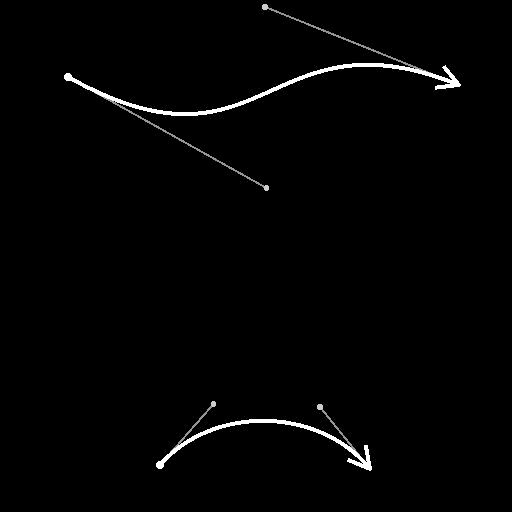

# Spline Bridge (2 Splines)

<table>
<tr style="border: 0;">
<td width="33.33%" style="border: 0;" valign="top">

<b>In:</b> Spline &amp; Path Tools &gt; Spline Tools

</td>
<td width="100.00%" style="border: 0;" valign="top">

## Description

Generates splines from <b>Spline &#35;1</b> to <b>Spline &#35;2</b> along these splines. The generated splines can be Linear (straight) or Cubic Bezier (curved).

</td>
</tr>
</table>

>[!IMPORTANT]
>
> If the data supplied to the <b>Spline &#35;1</b> and <b>Spline &#35;2</b> inputs contain more than one spline, only the last spline in each list is used.

## Input connectors

<b>Preview &#35;1</b> *Grayscale*The preview of the input splines #1 as a grayscale image.

<b>Spline Coords &#35;1</b> *Color*The coordinates of the input splines’ points #1 encoded in the RGBA channels of a color image.  
    <b>R</b> - X position  
    <b>G</b> - Y position  
    <b>B</b> - Height  
    <b>A</b> - Packed data:  
        * Sign: Spline is closed (negative) or open (positive);  
        * Absolute value: Thickness + 1.

<b>Spline Data &#35;1</b> *Color*Additional data of the input splines #1 encoded in the RGBA channels of a color image.  
    <b>R</b> - Tangents X  
    <b>G</b> - Tangents Y  
    <b>B</b> - Unused  
    <b>A</b> - Unused

<b>Spline Amount &#35;1</b> *Integer*The number of input splines #1.

<b>Preview &#35;2</b> *Grayscale*The preview of the input splines #2 as a grayscale image.

<b>Spline Coords &#35;2</b> *Color*The coordinates of the input splines’ #2 points encoded in the RGBA channels of a color image.  
    <b>R</b> - X position  
    <b>G</b> - Y position  
    <b>B</b> - Height  
    <b>A</b> - Packed data:  
        * Sign: Spline is closed (negative) or open (positive);  
        * Absolute value: Thickness + 1.

<b>Spline Data &#35;2</b> *Color*Additional data of the input splines #2 encoded in the RGBA channels of a color image.  
    <b>R</b> - Tangents X  
    <b>G</b> - Tangents Y  
    <b>B</b> - Unused  
    <b>A</b> - Unused

<b>Spline Amount &#35;2</b> *Integer*The number of input splines #2.

<b>Start Tangent Length Curve</b> *Grayscale* (Available when ‘Bridge Splines Type’ is set to ‘Cubic Bezier’)The image describing a curve using the values of its first row of pixels.  
This input is used to control the length of the ‘out’ tangents for the start point of each generated spline along Spline #1.  
You may use a Curve node to author the curve.

<b>Start Tangent Rotation Curve</b> *Grayscale* (Available when ‘Bridge Splines Type’ is set to ‘Cubic Bezier’)The image describing a curve using the values of its first row of pixels.  
This input is used to control the rotation of the ‘out’ tangents for the start point of each generated spline along Spline #1.  
The grayscale value of the image represents a number of turns.  
You may use a Curve node to author the curve.

<b>End Tangent Length Curve</b> *Grayscale* (Available when ‘Bridge Splines Type’ is set to ‘Cubic Bezier’)The image describing a curve using the values of its first row of pixels.  
This input is used to control the length of the ‘in’ tangents for the end point of each generated spline along Spline #2.  
You may use a Curve node to author the curve.

<b>End Tangent Rotation Curve</b> *Grayscale* (Available when ‘Bridge Splines Type’ is set to ‘Cubic Bezier’)The image describing a curve using the values of its first row of pixels.  
This input is used to control the rotation of the ‘in’ tangents for the end point of each generated spline along Spline #2.  
The grayscale value of the image represents a number of turns.  
You may use a Curve node to author the curve.

## Output connectors

<b>Preview</b> *Grayscale*The preview of the output splines as a grayscale image.

<b>Spline Coords</b> *Color*The coordinates of the output splines’ points encoded in the RGBA channels of a color image.  
    <b>R</b> - X position  
    <b>G</b> - Y position  
    <b>B</b> - Height  
    <b>A</b> - Packed data:  
        * Sign: Spline is closed (negative) or open (positive);  
        * Absolute value: Thickness + 1.

<b>Spline Data</b> *Color*Additional data of the output splines encoded in the RGBA channels of a color image.  
    <b>R</b> - Tangents X  
    <b>G</b> - Tangents Y  
    <b>B</b> - Unused  
    <b>A</b> - Unused

<b>Spline Amount</b> *Integer*The number of output splines.

## Parameters

<b>Bridge Splines Amount</b> *Integer*The number of splines generated along Spline #1 to Spline #2.

<b>Bridge Splines Type</b> *Integer*The type of spline that is generated:  
* Linear: a straight spline from Start to End;  
* Cubic Bezier: a curved spline from Start to End, the curve being controlled by the length and angle of the Start and End points.

<b>Start Spline &#35;1</b> *Float*Offsets the location along Spline #1 from where splines are generated. The value is the normalized length of Spline #1.  
A higher value results in the same number of splines being packed more tightly together.

<b>Start Spline &#35;2</b> *Float*Offsets the location along Spline #2 from where splines are generated. The value is the normalized length of Spline #2.  
A higher value results in the same number of splines being packed more tightly together.

<b>End Spline &#35;1</b> *Float*Offsets the location along Spline #1 up to where splines are generated. The value is the normalized length of Spline #1.  
A lower value results in the same number of splines being packed more tightly together.

<b>End Spline &#35;1</b> *Float*Offsets the location along Spline #2 up to where splines are generated. The value is the normalized length of Spline #2.  
A lower value results in the same number of splines being packed more tightly together.

<b>Offset Spline &#35;1</b> *Float*Applies an offset to the starting point of all splines along Spline #1. The value is the normalized length of Spline #1.  
Splines that meet the start or end of the spline are left there.

<b>Offset Spline &#35;2</b> *Float*Applies an offset to the starting point of all splines along Spline #2. The value is the normalized length of Spline #2.  
Splines that meet the start or end of the spline are left there.

<b>Offset Random Start</b> *Float*Applies a random offset to the starting point of each spline along Spline #1. The value is the normalized distance between splines on Spline #1.  
When left at 0, the splines are evenly spaced between the Start Spline #1 and End Spline #1 points.

<b>Offset Random End</b> *Float*Applies a random offset to the ending point of each spline along Spline #2. The value is the normalized distance between splines on Spline #2.  
When left at 0, the splines are evenly spaced between the Start Spline #2 and End Spline #2 points.

<b>Tangent Length Start</b> *Float* (Available when ‘Bridge Splines Type’ is set to ‘Cubic Bezier’)The length of the ‘out’ tangent for the start point on Spline #1 of all generated splines.

<b>Tangent Length End</b> *Float* (Available when ‘Bridge Splines Type’ is set to ‘Cubic Bezier’)The length of the ‘in’ tangent for the end point on Spline #2 of all generated splines.

<b>Tangent Rotation Start</b> *Float* (Available when ‘Bridge Splines Type’ is set to ‘Cubic Bezier’)The rotation of the ‘out’ tangent for the start point on Spline #1 of all generated splines.  
The value is a number of turns.

<b>Tangent Rotation End</b> *Float* (Available when ‘Bridge Splines Type’ is set to ‘Cubic Bezier’)The rotation of the ‘in’ tangent for the end point on Spline #2 of all generated splines.  
The value is a number of turns.

+++Preview
<b>Segments Amount</b> *Integer*Adjusts the number of segments used to draw the spline visualization in the Preview output.  
A higher value results in a smoother line.

<b>Show Direction Helper</b> *Boolean*Displays a dot at the start of the spline and an arrowhead at its end in the Preview output.

<b>Show Thickness Envelope</b> *Boolean*  
Displays additional lines at the edges of the spline’s thickness.

<b>Thickness (px)</b> *Float*Adjusts the thickness of the spline visualization in pixels in the Preview output.

+++

## Examples

<table>
<tr style="border: 0;">
<td style="border: 0;" valign="top">

<table>
  <tr>
    <td>
      
       <i>Before</i>
    </td>
    <td>
      
       <i>After</i>
    </td>
  </tr>
</table>

</td>
<td style="border: 0;" valign="top">

</td>
</tr>
</table>
