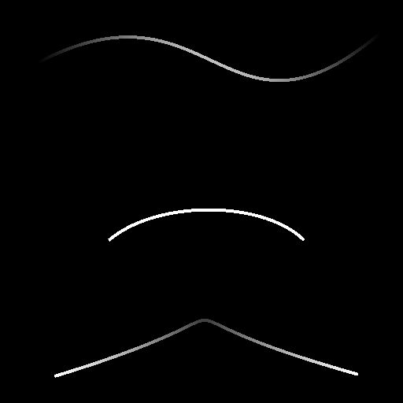

# Spline Bridge Mapper Grayscale

<table>
<tr style="border: 0;">
<td width="33.33%" style="border: 0;" valign="top">

<b>In:</b> Spline &amp; Path Tools &gt; Spline Tools

</td>
<td width="100.00%" style="border: 0;" valign="top">

## Description

Maps a grayscale image across a list of input splines so the image traverses the splines in order.

</td>
</tr>
</table>

>[!TIP]
>
> The mapping goes from the first spline in the list to the last and traverses the intermediary splines by strictly following the order of these splines in the list.
> 
> Therefore, you should be mindful about the order in which you append splines together beforehand.

>[!NOTE]
>
> See also [Spline Bridge Mapper Color](../../../../../../help/compositing-graphs/nodes-reference-for-com/node-library/spline-paths-tools/spline-tools/spline-bridge-mapper-col/spline-bridge-mapper-color.md).

## Input connectors

<b>Spline Coords</b> *Color*The coordinates of the input splines’ points encoded in the RGBA channels of a color image:

<b>    R</b> - X position  
<b>    G</b> - Y position  
<b>    B</b> - Height  
    <b>A</b> - Packed data:  
        * Sign: Spline is closed (negative) or open (positive);  
        * Absolute value: Thickness + 1.

<b>Spline Data</b> *Color*Additional data of the input splines encoded in the RGBA channels of a color image.  
<b>    R</b> - Tangents X  
<b>    G</b> - Tangents Y  
<b>    B</b> - Unused  
<b>    A</b> - Unused

<b>Spline Amount</b> *Integer*The number of input splines.

<b>Color Map</b>*Grayscale*The input grayscale image that should be mapped across the input splines.

## Output connectors

<b>Color</b> *Grayscale*The result of mapping the input Color image across the splines, as a grayscale image.

<b>Height</b> *Grayscale*The height of the splines mapped across the splines, as a grayscale image.

<b>UV</b> *Color*The UVs (I.e., coordinates) of the mapped image, encoded in the red (U) and green (V) channels of a color image.

<b>Mask</b> *Grayscale*A mask of the mapping across the splines.

## Parameters

<b>Segments Amount</b> *Integer*Splines are simplified into segments before image coordinates traverse them.  
A higher amount of segments results in a smoother mapping along curves.

<b>Reduce UVs Stretching</b> *Boolean*Adjusts the method used to interpolate the image coordinates from one spline to the next to minimize stretching when the distance between splines is uneven.

<b>UV Scale</b> *Float2*Adjusts the scale of the image coordinates. Higher values result in more a densely tiled image.

<b>UV Rotation</b> *Float*Rotates the image coordinates around their center.

## Examples

<table>
<tr style="border: 0;">
<td style="border: 0;" valign="top">

<table>
  <tr>
    <td>
      
       <i>Before</i>
    </td>
    <td>
      
       <i>After</i>
    </td>
  </tr>
</table>

</td>
<td style="border: 0;" valign="top">

</td>
</tr>
</table>

<table>
<tr style="border: 0;">
<td style="border: 0;" valign="top">

</td>
<td style="border: 0;" valign="top">

</td>
</tr>
</table>
