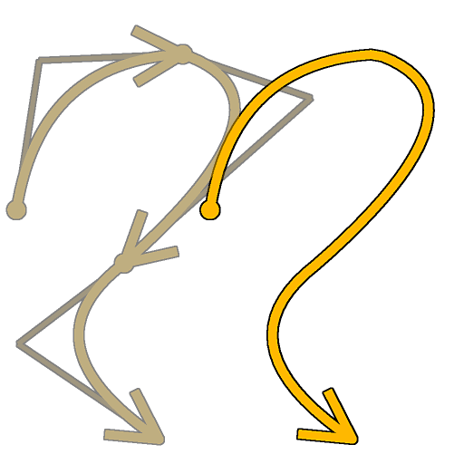

# Spline Merge List

<table>
<tr style="border: 0;">
<td style="border: 0;" valign="top">

<table>
<tr style="border: 0;">
<td width="33.33%" style="border: 0;" valign="top">

<b>In:</b> Spline &amp; Path Tools &gt; Spline Tools

</td>
<td width="100.00%" style="border: 0;" valign="top">

## Description

Merges all splines in the input list into a single spline.

</td>
</tr>
</table>

## Input connectors

<b>Spline Coords</b> *Color*The coordinates of the input splines’ points encoded in the RGBA channels of a color image:  
<b>    R</b> - X position  
<b>    G</b> - Y position  
<b>    B</b> - Height  
    <b>A</b> - Packed data:  
        * Sign: Spline is closed (negative) or open (positive);  
        * Absolute value: Thickness + 1.

<b>Spline Data</b> *Color*Additional data of the input splines encoded in the RGBA channels of a color image.  
<b>    R</b> - Tangents X  
<b>    G</b> - Tangents Y  
<b>    B</b> - Unused  
<b>    A</b> - Unused

<b>Spline Amount</b> *Integer*The number of input splines.

## Output connectors

<b>Preview</b> *Grayscale*The preview of the merged splines as a grayscale image.

<b>Spline Coords</b> *Color*The coordinates of the merged splines’ points encoded in the RGBA channels of a color image.  
    <b>R</b> - X position  
    <b>G</b> - Y position  
    <b>B</b> - Height  
    <b>A</b> - Packed data:  
        * Sign: Spline is closed (negative) or open (positive);  
        * Absolute value: Thickness + 1.

<b>Spline Data</b> *Color*Additional data of the merged splines encoded in the RGBA channels of a color image.  
    <b>R</b> - Tangents X  
    <b>G</b> - Tangents Y  
    <b>B</b> - Unused  
    <b>A</b> - Unused

<b>Spline Amount</b> *Integer*The number of merged splines.

## Parameters

<b>Closed Spline Distance Threshold</b> *Float*The distance in texture space below which two extremities of a same spline are processed as a single point closing that spline.  
This prevents overlaps when scattering shapes or mapping images along the splines.

+++Preview
<b>Segments Amount</b> *Integer*Adjusts the number of segments used to draw the spline visualization in the Preview output.  
A higher value results in a smoother line.

<b>Show Direction Helper</b> *Boolean*Displays a dot at the start of the spline and an arrowhead at its end in the Preview output.

<b>Show Thickness Envelope</b> *Boolean*  
Displays additional lines at the edges of the spline’s thickness.

<b>Thickness (px)</b> *Float*Adjusts the thickness of the spline visualization in pixels in the Preview output.

+++

## Examples

<table>
<tr style="border: 0;">
<td style="border: 0;" valign="top">

<table>
  <tr>
    <td>
      
       <i>Before</i>
    </td>
    <td>
      
       <i>After</i>
    </td>
  </tr>
</table>

</td>
<td style="border: 0;" valign="top">

<table>
  <tr>
    <td>
      
       <i>Before</i>
    </td>
    <td>
      
       <i>After</i>
    </td>
  </tr>
</table>

</td>
</tr>
</table>

</td>
<td style="border: 0;" valign="top">

</td>
<td style="border: 0;" valign="top">

</td>
</tr>
</table>
