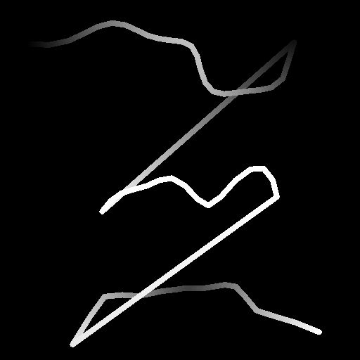

# Spline Warp

<table>
<tr style="border: 0;">
<td width="33.33%" style="border: 0;" valign="top">

<b>In:</b> Spline &amp; Path Tools &gt; Spline Tools

</td>
<td width="100.00%" style="border: 0;" valign="top">

## Description

Displaces the input splines based on the input Intensity Map or Vector Map.

The intensity of the warping effect can be adjusted along the spline using attenuation controls.

</td>
</tr>
</table>

## Inputs

|  |  |
|:---|:---|
| <b>Preview</b> <i>Grayscale</i> | The preview of the input splines as a grayscale image. |
| <b>Spline Coords</b> <i>Color</i> | The coordinates of the input splines’ points encoded in the RGBA channels of a color image: <b>R</b> - X position <b>G</b> - Y position <b>B</b> - Height <b>A</b> - Packed data: &nbsp;&nbsp;- Sign: Spline is closed (negative) or open (positive); &nbsp;&nbsp;- Absolute value: Thickness + 1. |
| <b>Spline Data</b> <i>Color</i> | Additional data of the input splines encoded in the RGBA channels of a color image. <b>R</b> - Tangents X <b>G</b> - Tangents Y <b>B</b> - Unused <b>A</b> - Unused |
| <b>Spline Amount</b> <i>Integer</i> | The number of input splines. |
| <b>Intensity Map</b> <i>Grayscale</i> | (Available when ‘Use Vector Map’ is set to ‘False’) The input grayscale image used to control the direction and intensity of the warping effect on the input splines. The color of each pixel in the image specifies a multiplier for displacing the spline’s points along their normal (I.e., the direction perpendicular to the spline), up to the full span of the image. The &#91;0; 1&#93; values in the image are remapped to the &#91;-1; 1&#93; range when read as a multiplier: 0 and 1 displace the spline by the same distance but in opposite directions. 0.5 leaves the spline in place. |
| <b>Vector Map</b> <i>Grayscale</i> | (Available when ‘Use Vector Map’ is set to ‘True’) The input color image used to control the direction and intensity of the warping effect on the input splines. The color of each pixel in the image specifies vector (X, Y) which coordinates are encoded in the red (X) and green (Y) channels. +X is right and +Y is down. The &#91;0; 1&#93; values in the image are remapped to the &#91;-1; 1&#93; range when read as vector coordinates: 0 red displaces points left and 0 green displaces points up. 0.5 red and green leaves the spline in place. |
| <b>Attenuation Curve</b> <i>Grayscale</i> | The image describing a curve using the values of its first row of pixels. When the Use Attenuation Curve parameter is set to True, this input is used to control the attenuation of the warping effect near the start and end of the spline. The curve provides a profile for the attenuation, where the first pixel in the row is the intensity of the warping effect at the start of the spline, and the last is the intensity at the end. The grayscale value is the intensity. You may use a Curve node to author the curve. |

## Outputs

|  |  |
|:---|:---|
| <b>Preview</b> <i>Grayscale</i> | The preview of the output splines as a grayscale image. |
| <b>Spline Coords</b> <i>Color</i> | The coordinates of the output splines’ points encoded in the RGBA channels of a color image. <b>R</b> - X position <b>G</b> - Y position <b>B</b> - Height <b>A</b> - Packed data: &nbsp;&nbsp;- Sign: Spline is closed (negative) or open (positive); &nbsp;&nbsp;- Absolute value: Thickness + 1. |
| <b>Spline Data</b> <i>Color</i> | Additional data of the output splines encoded in the RGBA channels of a color image. <b>R</b> - Tangents X <b>G</b> - Tangents Y <b>B</b> - Unused <b>A</b> - Unused |
| <b>Spline Amount</b> <i>Integer</i> | The number of output splines. |

## Parameters

|  |  |
|:---|:---|
| <b>Warp Intensity</b> <i>Float</i> | The intensity by which the splines are displaced. |
| <b>Warp Center</b> <i>Float</i> | Specifies the Intensity Map value that corresponds to leaving the splines in place. A value of 0 or 1 means the splines can only be displaced on one side. |
| <b>Sampling Mode</b> <i>Integer</i> | The method of mapping the values in the Intensity Map or Vector Map to the splines: - <i>Texture space</i>: The values are applied to the splines where they would be if placed in a texture using the texture’s UV coordinates. This effectively applies the value to the splines ‘in place’; - <i>Horizontal along spline</i>: The values are applied to the encoded splines’ coordinates directly (see Spline Coords input), where each row is applied to a different spline from top to bottom; - <i>Hor. along spline (rand. offset X)</i>: The values are applied to the encoded splines’ coordinates directly (see Spline Coords input), with a random horizontal offset in the Scale map for each spline (I.e., each row in Spline Coords); - <i>Hor. along spline (rand. offset Y)</i>: The values are applied to the encoded splines’ coordinates directly (see Spline Coords input), with a random vertical offset in the Scale map for each spline (I.e., each row in Spline Coords). |
| <b>Use Vector Map</b> <i>Boolean</i> | Switches the method of displacing the splines to the use of a Vector Map input for specifying the direction of the displacement. The color of each pixel in the image specifies vector (X, Y) which coordinates are encoded in the red (X) and green (Y) channels. +X is right and +Y is down. The &#91;0; 1&#93; values in the image are remapped to the &#91;-1; 1&#93; range when read as vector coordinates: 0 red displaces points left and 0 green displaces points up. 0.5 red and green leaves the spline in place. |
| <b>Use Attenuation Curve</b> <i>Boolean</i> | Enables controlling the intensity of the warping effect along a spline using a curve encoded in the Attenuation Curve input image. |
| <b>Intensity Map Tiling</b> <i>Float</i> | (Available when ‘Sampling Mode’ is not set to ‘Texture Space’) Adjusts the tiling of the Intensity Map when mapped to the spline coordinates directly (see Spline Coords input). |
| <b>Start Attenuation</b> <i>Float</i> | (Available when ‘Use Attenuation Curve’ is set to ‘False’) A multiplier for the attenuation of the warping effect near the start of the spline. A value of 1 means no warping is applied to the start of the spline. |
| <b>End Attenuation</b> <i>Float</i> | (Available when ‘Use Attenuation Curve’ is set to ‘False’) A multiplier for the attenuation of the warping effect near the end of the spline. A value of 1 means no warping is applied to the end of the spline. |
| <b>Recompute Tangents</b> <i>Boolean</i> | When True, a spline’s tangents are recomputed after the warping effect is applied. This ensures the spline’s tangents remain consistent with its trajectory when used in nodes such as Scatter on Spline or Spline Flow Mapper. |
| <b>Preview</b> |  |
| <b>Segments Amount</b> <i>Integer</i> | Adjusts the number of segments used to draw the spline visualization in the Preview output. A higher value results in a smoother line. |
| <b>Show Direction Helper</b> <i>Boolean</i> | Displays a dot at the start of the spline and an arrowhead at its end in the Preview output. |
| <b>Show Thickness Envelope</b> <i>Boolean</i> | Displays additional lines at the edges of the spline’s thickness. |
| <b>Thickness (px)</b> <i>Float</i> | Adjusts the thickness of the spline visualization in pixels in the Preview output. |
| <b>Background Preview Intensity</b> <i>Float</i> | The value multiplied against the background Preview input image. |

## Examples

<table>
<tr style="border: 0;">
<td style="border: 0;" valign="top">

<table>
  <tr>
    <td>
      
       <i>Before</i>
    </td>
    <td>
      
       <i>After</i>
    </td>
  </tr>
</table>

</td>
<td style="border: 0;" valign="top">

<table>
  <tr>
    <td>
      
       <i>Before</i>
    </td>
    <td>
      
       <i>After</i>
    </td>
  </tr>
</table>

</td>
</tr>
</table>

<table>
<tr style="border: 0;">
<td style="border: 0;" valign="top">

</td>
<td style="border: 0;" valign="top">

</td>
</tr>
</table>
