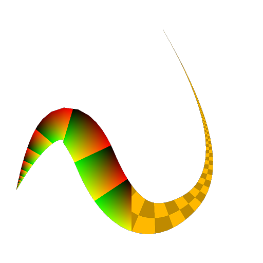

# UV Mapper Color

<table>
<tr style="border: 0;">
<td width="33.33%" style="border: 0;" valign="top">

<b>In:</b> Spline &amp; Path Tools &gt; Spline Tools

</td>
<td width="100.00%" style="border: 0;" valign="top">

## Description

Maps the input color image using the coordinates provided in the UV input.

</td>
</tr>
</table>

>[!NOTE]
>
> See also [UV Mapper Grayscale](../../../../../../compositing-graphs/nodes-reference-for-com/node-library/spline-paths-tools/spline-tools/uv-mapper-grayscale/uv-mapper-grayscale.md).

## Inputs

|  |  |
|:---|:---|
| <b>UV</b> <i>Color</i> | Image coordinates encoded in the red (U) and green (V) channels of a color image. |
| <b>Input</b> <i>Color</i> | The color image which should be mapped to the coordinates provided in the UV input. |

## Outputs

|  |  |
|:---|:---|
| <b>Output</b> <i>Color</i> | The result of mapping the Input image using the input UV coordinates, as a color image. |

## Parameters

|  |  |
|:---|:---|
| <b>Background Color</b> <i>Float4</i> | The background color of the output image. The background is visible in the areas of the image where UVs are not defined (I.e., the value is (0, 0, 0, 0)). |

## Examples

<table>
<tr style="border: 0;">
<td style="border: 0;" valign="top">

<table>
  <tr>
    <td>
      
       <i>Before</i>
    </td>
    <td>
      
       <i>After</i>
    </td>
  </tr>
</table>

</td>
<td style="border: 0;" valign="top">

<table>
  <tr>
    <td>
      
       <i>Before</i>
    </td>
    <td>
      
       <i>After</i>
    </td>
  </tr>
</table>

</td>
</tr>
</table>

