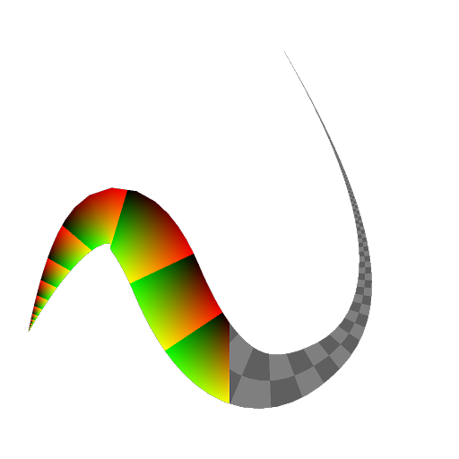

# UV Mapper Grayscale

<table>
<tr style="border: 0;">
<td style="border: 0;" valign="top">

<table>
<tr style="border: 0;">
<td width="33.33%" style="border: 0;" valign="top">

<b>In:</b> Spline &amp; Path Tools &gt; Spline Tools

</td>
<td width="100.00%" style="border: 0;" valign="top">

## Description

Maps the input grayscale image using the coordinates provided in the UV input.

</td>
</tr>
</table>

>[!NOTE]
>
> See also [UV Mapper Color](../uv-mapper-color/uv-mapper-color.md).

## Input connectors

<b>UV</b> *Color*Image coordinates encoded in the red (U) and green (V) channels of a color image.

<b>Input</b> *Color*The grayscale image which should be mapped to the coordinates provided in the UV input.

## Output connectors

<b>Output</b> *Color*The result of mapping the Input image using the input UV coordinates, as a grayscale image.

## Examples

<table>
<tr style="border: 0;">
<td style="border: 0;" valign="top">

<table>
  <tr>
    <td>
      
       <i>Before</i>
    </td>
    <td>
      
       <i>After</i>
    </td>
  </tr>
</table>

</td>
<td style="border: 0;" valign="top">

<table>
  <tr>
    <td>
      
       <i>Before</i>
    </td>
    <td>
      
       <i>After</i>
    </td>
  </tr>
</table>

</td>
</tr>
</table>

</td>
<td style="border: 0;" valign="top">

</td>
<td style="border: 0;" valign="top">

</td>
</tr>
</table>
