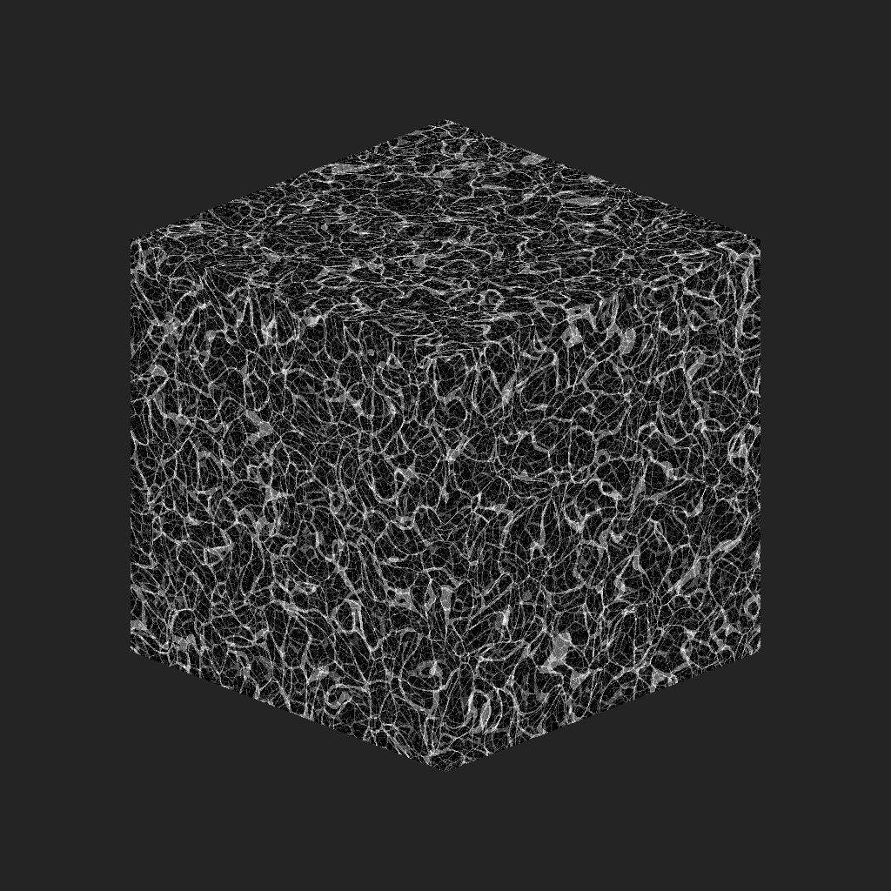
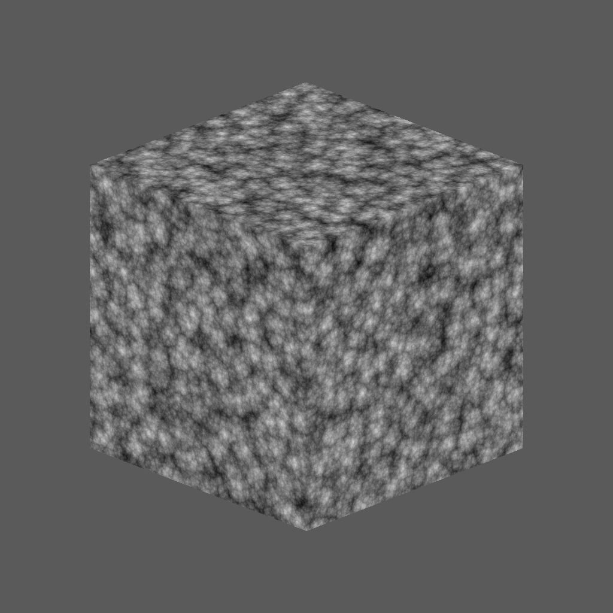

# 3D Voronoi Fractal

<table>
<tr style="border: 0;">
<td width="33.33%" style="border: 0;" valign="top">

{width="200px"}

<b>In:</b> Texture Generators &gt; Noises

</td>
<td width="100.00%" style="border: 0;" valign="top">

## Description

The <b>3D Voronoi Fractal</b> node generates a <i>fractal</i> Voronoi noise in 3D space based on the <b>Position Map</b> input.

This node can be tested with [Cube 3D GBuffers](../../../../../../compositing-graphs/nodes-reference-for-com/node-library/texture-generators/patterns/cube-3d-gbuffers/cube-3d-gbuffers.md) as input instead of an actual baked map (as seen in the Example Image below).

</td>
</tr>
</table>

>[!WARNING]
>
> This noise is meant to be used with the <i>GPU engine only</i> (i.e., <b>Direct3D</b> or <b>OpenGL</b>). Go to <b>Tools &gt; Switch engine...</b> or press the <b>F9</b> key to select the desired engine.

## Parameters

|  |  |
|:---|:---|
| <b>Invert</b> <i>Boolean</i> | Inverts the output image. |
| <b>Scale</b> <i>Float</i> | Controls the scale of the fractal 3D Voronoi noise.  <i>Note</i>: When <b>Tiling</b> is enabled on <i>any axis</i>, the scale adjustement is <i>stepped</i>. This is expected. |
| <b>Size</b> <i>Float3</i> | Controls the size of the fractal 3D Voronoi noise in the <b>X</b>, <b>Y</b> and <b>Z</b> axes. Non-uniform values result in a <i>stretching or squashing</i> effect.  <i>Note</i>: When <b>Tiling</b> is enabled on <i>any axis</i>, the size adjustment is <i>stepped</i>. This is expected. |
| <b>Offset</b> <i>Float3</i> | Applies an offset to the <i>position</i> of the fractal 3D Voronoi noise in the <b>X</b>, <b>Y</b> and <b>Z</b> axes. |
| <b>Disorder</b> <i>Float3</i> | The intensity of the <i>random offset</i> applied to each point of the noise in the <b>X</b>, <b>Y</b> and <b>Z</b> axes. |
| <b>Distortion Intensity</b> <i>Float</i> | Controls the intensity of a <i>warping effect</i> applied on the fractal 3D Voronoi noise. |
| <b>Distortion Scale Multiplier</b> <i>Float</i> | Controls the scale of the <i>deforming pattern</i> used in the warping effect controlled by the <b>Distortion Intensity</b>. |
| <b>Min Level</b> <i>Integer</i> | The minimum <i>level of of repetition</i> used in the fractal pattern. A wider minimum/maximum range results in a <i>richer pattern</i> with variation on more frequency ranges. |
| <b>Max Level</b> <i>Integer</i> | The maximum <i>level of of repetition</i> used in the fractal pattern. A wider minimum/maximum range results in a <i>richer pattern</i> with variation on more frequency ranges. |
| <b>Roughness</b> <i>Float</i> | Controls the <i>balance</i> between low and high <i>levels of repetition</i> in the fractal pattern.  <i>Note</i>: A value of <b>0</b> results in an output which is <i>not in line</i> with other low values following it. This is expected.  <i>Note 2</i>: This parameter is only available when the <b>Blend Mode</b> parameter is set to <i>Add</i>. |
| <b>Lacunarity</b> <i>Float</i> | Controls how the applied fractal pattern <i>fills space</i>. A <i>higher</i> value results in <i>less gaps</i> in the pattern and a <i>denser</i> noise. |
| <b>Global Opacity</b> <i>Float</i> | Controls the <i>range</i> of the fractal 3D Perlin noise values from 0. |
| <b>Rounded Curve</b> <i>Float</i> | Rounds the <i>slope</i> around each point of the noise to make it <i>convex</i>.  <i>Note</i>: This parameter is not available when the <b>Style</b> parameter is set to <i>Edge</i>. |
| <b>Distance Scale</b> <i>Float</i> | Adjusts the <i>distance of the gradient</i> around each point of the noise. |
| <b>Distance Mode</b> <i>Integer</i> | Sets the method to <i>compute the distance gradient</i> around each point of the noise:  - <i>Euclidean</i> - <i>Manhattan</i> - <i>Chebyshev</i> - <i>Minkowski</i> |
| <b>Minkowski Number</b> <i>Float</i> | The order <i>p</i> of the Minkowski distance. If we divide the distance gradient into quadrants, this number impacts these quadrants as follows:  - p is <i>exactly</i> 1: Straight - p is <i>lower</i> than 1: Concave - p is <i>greater</i> than 1: Convex  Interesting values: - <i>1.0</i>: Manhattan distance - <i>2.0</i>: Euclidean distance - <i>Infinity</i>: Chebyshev distance  <i>Note</i>: This parameter is only available when the <b>Distance Mode</b> parameter is set to <i>Minkowski</i>. |
| <b>Blend Mode</b> <i>Integer</i> | Sets the method of blending together the values of <i>overlapping cells</i> in 3D space:  - <i>Add</i>: Add the values - <i>Max</i>: Retain the <i>highest</i> value - <i>Min</i>: Retain the <i>lowest</i> value |
| <b>Style</b> <i>Integer</i> | Sets the method <i>rendering the data</i> of the fractal 3D Voronoi noise, considering the noise is based on a set of points in 3D space:  - <i>F1</i>: the distance to the <i>closest point</i> in 3D space - <i>F2</i>: the distance to the <i>second closest point</i> in 3D space - <i>F2-F1</i> - <i>F1\*F2</i> - <i>F1/F2</i> - <i>Edge</i>: the <i>edge between each cell</i> of the noise in 3D space - <i>Random color</i>: assign a <i>random flat color</i> to each cell of the noise in 3D space |
| <b>Edge Thickness</b> <i>Float</i> | Adjusts the thickness of the edges detected between cells of the fractal 3D Voronoi noise. Edges are detected in the X, Y and Z axes, thus some thicknesses may increase quicker than other depending on the cells' <i>depth</i>.  <i>Note</i>: This parameter is only available when the <b>Style</b> parameter is set to <i>Edge</i>. |
| <b>Enable Tiling</b> <i>Boolean</i> | Adjusts the fractal 3D Voronoi noise so its resulting pattern <i>repeats</i> in the X, Y and Z axes. |

## Examples

<table style="margin-top: 32px; margin-bottom: 32px">
    <tr style="border: 0">
        <td style="border: 0; background: transparent">
            
        </td>
        <td style="border: 0; background: transparent">
            
        </td>
        <td style="border: 0; background: transparent">
            
        </td>
    </tr>
    <tr style="border: 0; background: transparent">
        <td style="border: 0; background: transparent">
            
        </td>
        <td style="border: 0; background: transparent">
            
        </td>
        <td style="border: 0; background: transparent">
            
        </td>
    </tr>
</table>
