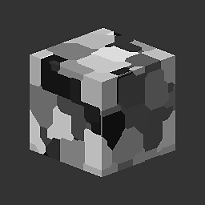
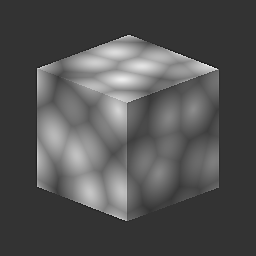

# 3D Worley Noise

<table>
<tr style="border: 0;">
<td style="border: 0;" valign="top">

{width="128px"}

## 3D Worley Noise

**In:** *Texture Generators**/Noises*

**Intermediate**

</td>
<td style="border: 0;" valign="top">

## Description

One of the most versatile and advanced noises in the library, it generates a Worley noise in 3D space, based on an input Position map. Has plenty of options that make it much more powerful than the standard [Cells ](../../../../../../help/compositing-graphs/nodes-reference-for-com/node-library/texture-generators/noises/cells-1/cells-1.md)or [Distance ](../../../../../../help/compositing-graphs/nodes-reference-for-com/atomic-nodes/distance/distance.md)based noises.

## Parameters

* **Scale**: *1 - 64*  
  Set the global scale for the effect.
* **Size**: *0.0 - 1.0*Perform non-uniform scaling on X, Y and Z axes separately.
* **Mode**: *Euclidean, Manhattan, Chebyshev, Minkowski  
  Change the distance metric. Allows for some very different noise types.*
* **Minkowski Number**: *0.0 - 20.0*Only with Minkowski distance metric. Blends between different types of metrics.
* **Style**: *F1, F2, F2-F1, Border, Random Color*Set the Metric combination math. Allows for many more combinations.
* **Border Width**: *0.0 - 1.0*When Border combination math is active, controls the width of the border.
* **Roundess**: *0.0 - 1.0*Only availble with F1, F2 and F2-F1 modes. Sets the level mid position.
* **Invert**: *False/True*  
  Inverts the result.

## Example Images

| 

 | 

 | 

 | 

 |
| --- | --- | --- | --- |
|  |  |  |  |

</td>
</tr>
</table>
