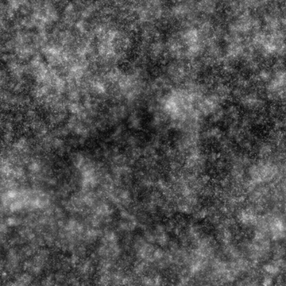
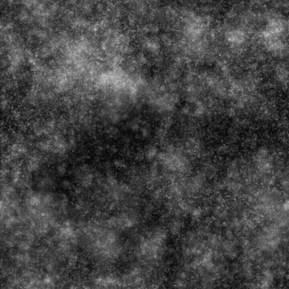

# BnW spots 1

<table>
<tr style="border: 0;">
<td width="33.33%" style="border: 0;" valign="top">

{width="200px"}

<b>In:</b> Texture generators &gt; Noises

</td>
<td width="100.00%" style="border: 0;" valign="top">

## Description

A variation of the rough <b>Black and white (BnW) spots</b> noises.

See also: [BnW spots 2](../../../../../../compositing-graphs/nodes-reference-for-com/node-library/texture-generators/noises/bnw-spots-2/bnw-spots-2.md), [BnW spots 3](../../../../../../compositing-graphs/nodes-reference-for-com/node-library/texture-generators/noises/bnw-spots-3/bnw-spots-3.md)

</td>
</tr>
</table>

## Outputs

|  |  |
|:---|:---|
| <b>Output</b> <i>Grayscale</i> | The generated noise as a grayscale bitmap. |

## Parameters

|  |  |
|:---|:---|
| <b>Scale</b> <i>Integer</i> | The subdivision of the grid used to generate the noise tiles.    A higher value results in more tiles being drawn and a denser noise. |
| <b>Disorder</b> <i>Float</i> | Displaces the ingredients of the noise.    This can be used to animate the noise. |
| <b>Disorder speed</b> <i>Float</i> | Adjusts the distance of displacement applied by the <b>Disorder</b> parameter.    This can be used to control the speed of displacement when animating the noise. |
| <b>Disorder anisotropy</b> <i>Float</i> | Controls the span of directions of the displacement applied by the <b>Disorder</b> parameter, where a higher value results in a narrower, more defined direction.    The direction is controlled by the <b>Disorder anisotropy angle</b> parameter. |
| <b>Disorder anisotropy angle</b> <i>Float</i> | Controls the direction of the displacement applied by the <b>Disorder</b> parameter, when the <b>Disorder anisotropy</b> parameter is not zero. |
| <b>Roughness</b> <i>Float</i> | The balance of the noise octaves, where a higher value will make the higher frequency octaves more visible. |
| <b>Tile offset</b> <i>Float2</i> | Controls the position of the portion of infinite plane used to render the noise. |
| <b>Non-square expansion</b> <i>Boolean</i> | In non-square images, keeps the generated tile square and expands the noise generation to the image's bounds. |

## Examples

<table>
<tr style="border: 0;">
<td style="border: 0;" valign="top">

{zoomable="yes"}

</td>
<td style="border: 0;" valign="top">

{zoomable="yes"}

</td>
</tr>
</table>

<table>
<tr style="border: 0;">
<td style="border: 0;" valign="top">

{zoomable="yes"}

</td>
<td style="border: 0;" valign="top">

{zoomable="yes"}

</td>
</tr>
</table>
