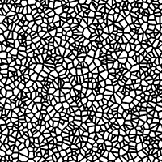
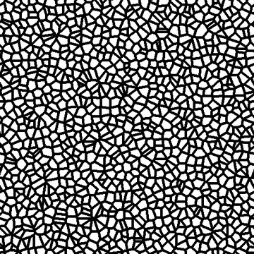

# Cells 2

<table>
<tr style="border: 0;">
<td style="border: 0;" valign="top">

<table>
<tr style="border: 0;">
<td width="33.33%" style="border: 0;" valign="top">

{width="200px"}

<b>In:</b> Texture generators &gt; Noises

</td>
<td width="100.00%" style="border: 0;" valign="top">

## Description

A variation of the <b>Cells</b> walled noises.  
  
A binary mask of the cells with an adjustable wall thickness.

See also: [Cells 1](../../../../../../compositing-graphs/nodes-reference-for-com/node-library/texture-generators/noises/cells-1/cells-1.md), [Cells 3](../../../../../../compositing-graphs/nodes-reference-for-com/node-library/texture-generators/noises/cells-3/cells-3.md), [Cells 4](../../../../../../compositing-graphs/nodes-reference-for-com/node-library/texture-generators/noises/cells-4/cells-4.md)

</td>
</tr>
</table>

<table>
<tr style="border: 0;">
<td style="border: 0;" valign="top">

### Outputs

</td>
<td style="border: 0;" valign="top">

### Parameters

</td>
<td style="border: 0;" valign="top">

### Examples

</td>
</tr>
</table>

## Outputs

|  |  |
| --- | --- |
| <b>Output</b> *Grayscale* | The generated noise as a grayscale bitmap. |

## Parameters

|  |  |
| --- | --- |
| <b>Scale</b>  Integer | The subdivision of the grid used to generate the noise tiles.    A higher value results in more tiles being drawn and a denser noise. |
| <b>Edge width</b>  Float | Adjusts the thickness of the walls between cells, as a ratio of the grid. (I.e. not dependent on resolution) |
| <b>Invert</b>  Boolean | Switches blacks and whites in the output image. |
| <b>Disorder</b>  Float | Displaces the ingredients of the noise.    This can be used to animate the noise. |
| <b>Disorder speed</b>  Float | Adjusts the distance of displacement applied by the <b>Disorder</b> parameter.    This can be used to control the speed of displacement when animating the noise. |
| <b>Non-square expansion</b>  Boolean | In non-square images, keeps the generated tile square and expands the noise generation to the image's bounds. |

## Examples

<table>
<tr style="border: 0;">
<td style="border: 0;" valign="top">

.png "Cells 2 - Example 1"){zoomable="yes"}

</td>
<td style="border: 0;" valign="top">

{zoomable="yes"}

</td>
</tr>
</table>

</td>
<td style="border: 0;" valign="top">

</td>
<td style="border: 0;" valign="top">

</td>
</tr>
</table>
