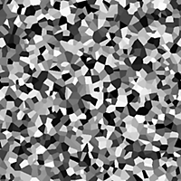

# Cells 4

<table>
<tr style="border: 0;">
<td style="border: 0;" valign="top">

<table>
<tr style="border: 0;">
<td width="33.33%" style="border: 0;" valign="top">

{width="200px"}

<b>In:</b> Texture generators &gt; Noises

</td>
<td width="100.00%" style="border: 0;" valign="top">

## Description

A variation of the <b>Cells</b> walled noises.  
  
Each cell is assigned a flat color, which may be random or sampled from an input image.

See also: [Cells 1](../../../../../../compositing-graphs/nodes-reference-for-com/node-library/texture-generators/noises/cells-1/cells-1.md), [Cells 2](../../../../../../compositing-graphs/nodes-reference-for-com/node-library/texture-generators/noises/cells-2/cells-2.md), [Cells 3](../../../../../../compositing-graphs/nodes-reference-for-com/node-library/texture-generators/noises/cells-3/cells-3.md)

</td>
</tr>
</table>

<table>
<tr style="border: 0;">
<td style="border: 0;" valign="top">

### Inputs

</td>
<td style="border: 0;" valign="top">

### Outputs

</td>
<td style="border: 0;" valign="top">

### Parameters

</td>
<td style="border: 0;" valign="top">

### Examples

</td>
</tr>
</table>

## Inputs

|  |  |
| --- | --- |
| <b>Input</b> *Grayscale* |  |

## Outputs

|  |  |
| --- | --- |
| <b>Output</b> *Grayscale* | The generated noise as a grayscale bitmap. |

## Parameters

|  |  |
| --- | --- |
| <b>Scale</b>  Integer | The subdivision of the grid used to generate the noise tiles.    A higher value results in more tiles being drawn and a denser noise. |
| <b>Disorder</b>  Float | Displaces the ingredients of the noise.    This can be used to animate the noise. |
| <b>Disorder speed</b>  Float | Adjusts the distance of displacement applied by the <b>Disorder</b> parameter.    This can be used to control the speed of displacement when animating the noise. |
| <b>Color source</b>  Integer | The source of the flat color applied to the cells:<ul data-preserve-html="true"> <li data-preserve-html="true"><b><i>Random:</i></b> Use a random color controlled by the node's random seed</li> <li data-preserve-html="true"><b><i>Pseudorandom:</i></b> Use a random color seeded by a separate user-set value</li> <li data-preserve-html="true"><b><i>Image input:</i></b> Use the color sampled at the cell location in the input image</li> </ul> |
| <b>Pseudorandom seed</b>  Integer   *Available when 'Color source' is set to 'Pseudorandom'* | Allows to change the seed for the color separately from the node seed. |
| <b>Non-square expansion</b>  Boolean | In non-square images, keeps the generated tile square and expands the noise generation to the image's bounds. |

## Examples

<table>
<tr style="border: 0;">
<td style="border: 0;" valign="top">

.png "Cells 4 - Example 1"){zoomable="yes"}

</td>
<td style="border: 0;" valign="top">

{zoomable="yes"}

</td>
</tr>
</table>

</td>
<td style="border: 0;" valign="top">

</td>
<td style="border: 0;" valign="top">

</td>
</tr>
</table>
