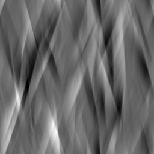

# Crystal 2

<table>
<tr style="border: 0;">
<td width="33.33%" style="border: 0;" valign="top">

{width="128px"}

<b>In:</b> Texture Generators &gt; Noises

</td>
<td width="100.00%" style="border: 0;" valign="top">

## Description

Generates an angular, cloth crease-like pattern. Similar to [Crease Noise](../../../../../../compositing-graphs/nodes-reference-for-com/node-library/texture-generators/noises/creased/creased.md).

This is a bit of a niche noise: it can be useful for rare cases where you're after this type of detail, such as when recreating subtle marble patterns or doing cloth.

</td>
</tr>
</table>

## Parameters

|  |  |
|:---|:---|
| <b>Scale</b> <i>1 - 16</i> | Sets the global scale for the effect. |
| <b>Disorder</b> <i>0.0 - 1.0</i> | Phase-shifts the noise to introduce small variation. |
| <b>Non Square Expansion</b> <i>False/True</i> | Enables compensation of squash and stretch with non-square ratios. |

## Examples

<table style="margin-top: 32px; margin-bottom: 32px">
    <tr style="border: 0">
        <td style="border: 0; background: transparent">
            
        </td>
    </tr>
</table>
