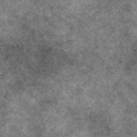

# Fractal sum base

<table>
<tr style="border: 0;">
<td style="border: 0;" valign="top">

<table>
<tr style="border: 0;">
<td width="33.33%" style="border: 0;" valign="top">

{width="200px"}

<b>In:</b> Texture generators &gt; Noises

</td>
<td width="100.00%" style="border: 0;" valign="top">

## Description

A customisable fractal noise with an adjustable range and balance of octaves.  
  
The <b>Fractal sum</b> family of noises are all based on this node.

See also: [Fractal sum 1](../../../../../../compositing-graphs/nodes-reference-for-com/node-library/texture-generators/noises/fractal-sum-1/fractal-sum-1.md), [Fractal sum 2](../../../../../../compositing-graphs/nodes-reference-for-com/node-library/texture-generators/noises/fractal-sum-2/fractal-sum-2.md), [Fractal sum 3](../../../../../../compositing-graphs/nodes-reference-for-com/node-library/texture-generators/noises/fractal-sum-3/fractal-sum-3.md), [Fractal sum 4](../../../../../../compositing-graphs/nodes-reference-for-com/node-library/texture-generators/noises/fractal-sum-4/fractal-sum-4.md)

</td>
</tr>
</table>

<table>
<tr style="border: 0;">
<td style="border: 0;" valign="top">

### Outputs

</td>
<td style="border: 0;" valign="top">

### Parameters

</td>
<td style="border: 0;" valign="top">

### Examples

</td>
</tr>
</table>

## Outputs

|  |  |
| --- | --- |
| <b>Output</b> *Grayscale* | The generated noise as a grayscale bitmap. |

## Parameters

|  |  |
| --- | --- |
| <b>Roughness</b>  Float | The balance of the noise octaves.    A higher value will make the higher frequency octaves more visible. |
| <b>Min. level</b>  Integer | The minimum octave used in the noise.    A higher value results in a higher noise frequency. |
| <b>Max. level</b>  Integer | The maximum octave used in the noise.    A higher value results in a higher noise frequency. |
| <b>Disorder</b>  Float | Displaces the ingredients of the noise.    This can be used to animate the noise. |
| <b>Disorder speed</b>  Float | Adjusts the distance of displacement applied by the <b>Disorder</b> parameter.    This can be used to control the speed of displacement when animating the noise. |
| <b>Contrast</b>  Float | The contrast of the final result. |
| <b>Global opacity</b>  Float | The opacity of the noise octaves added together in the final result.    A high value may result in areas being burned to white. |
| <b>Non-square expansion</b>  Boolean | In non-square images, keeps the generated tile square and expands the noise generation to the image's bounds. |

## Examples

<table>
<tr style="border: 0;">
<td style="border: 0;" valign="top">

.png "Fractal sum base - Example 1"){zoomable="yes"}

</td>
<td style="border: 0;" valign="top">

{zoomable="yes"}

</td>
</tr>
</table>

</td>
<td style="border: 0;" valign="top">

</td>
<td style="border: 0;" valign="top">

</td>
</tr>
</table>
