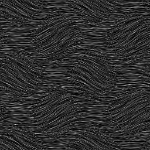

# Fur 2

<table>
<tr style="border: 0;">
<td style="border: 0;" valign="top">

{width="128px"}

## Fur 2

**In:** *Texture Generators**/Noises*

**Simple**

</td>
<td style="border: 0;" valign="top">

## Description

This generates a wavy type of fur-like noise.

## Parameters

* **Scale**: *1 - 8*  
  Sets the global scale for the effect.
* **Waves Scale**: *0.0 - 1.0*  
  Modifies the scale of the waves, bigger means less repetitions.
* **Waves Rotation**: *0.0 - 1.0*  
  Twists the waves more. This value should probably be kept low, as results can be extreme.
* **Non Square Expansion**: *False/True*  
  Enables compensation of squash and stretch with non-square ratios.

## Example Images

</td>
</tr>
</table>
