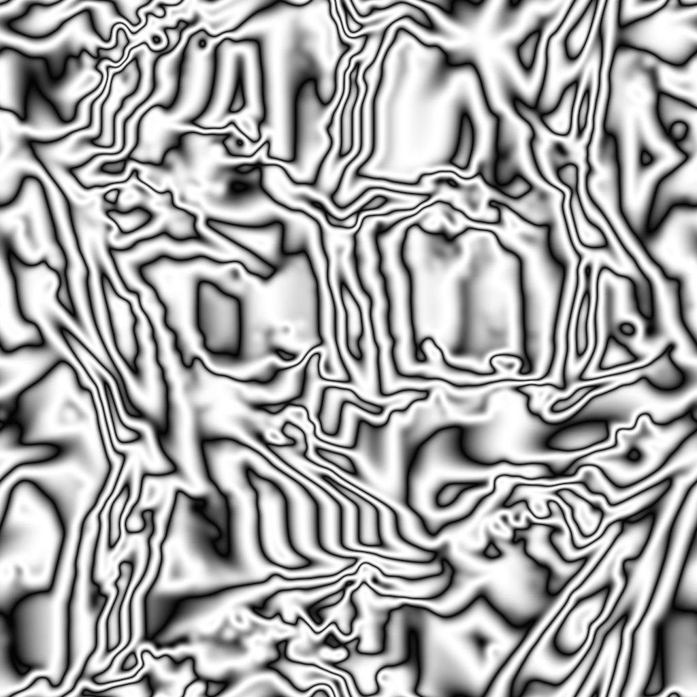

# Grunge Damas

<table>
<tr style="border: 0;">
<td width="33.33%" style="border: 0;" valign="top">

{width="200px"}

<b>In:</b> Texture generators &gt; Noises

</td>
<td width="100.00%" style="border: 0;" valign="top">

## Description

The **Grunge Damas** node generates a grunge map akin to a Damascus steel pattern.

</td>
</tr>
</table>

## Parameters

|  |  |
|:---|:---|
| <b>Balance</b> <i>Float</i> | Adjusts the balance between dark and bright values. |
| <b>Contrast</b> <i>Float</i> | Adjusts the contrast of the image. |
| <b>Invert</b> <i>Boolean</i> | Inverts the output of the image, using a `1-x` operation. |
| <b>Non Square Expansion</b> <i>Boolean</i> | Enables compensation of squash and stretch with non-square ratios. |
| <b>Advanced</b> |  |
| <b>Distortion</b> <i>Float</i> | Adjusts the amount of distortion in the pattern. |
| <b>Divisions</b> <i>Integer</i> | Adjusts the amount of divisions, or gradient repetitions, in the pattern. |
| <b>Waves</b> <i>Integer</i> | Adjusts the amount of waves in the pattern. |
| <b>Details</b> <i>Float</i> | Adjusts the intensity of the smaller distortions. |
| <b>Rotation Random</b> <i>Float</i> | Adjusts the randomness of the rotation for each wave. |

## Examples

<table style="margin-top: 32px; margin-bottom: 32px">
    <tr style="border: 0">
        <td style="border: 0; background: transparent">
            
        </td>
    </tr>
</table>
