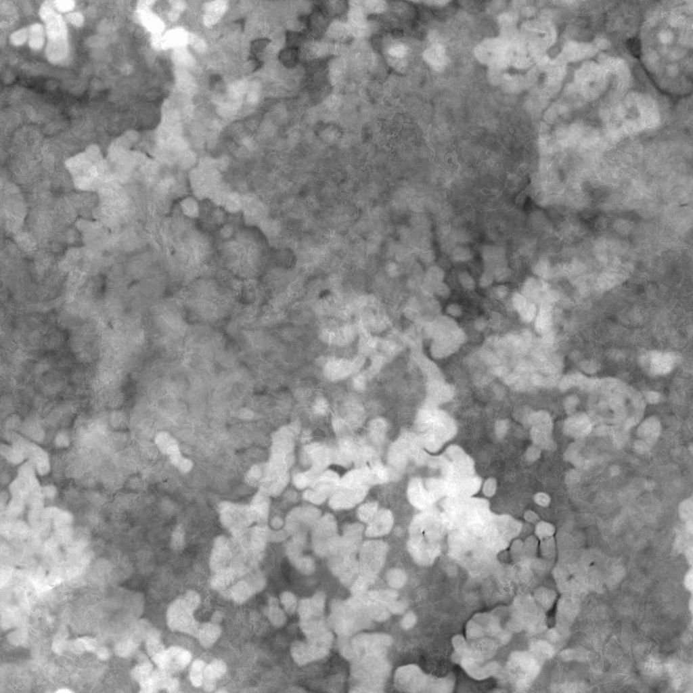
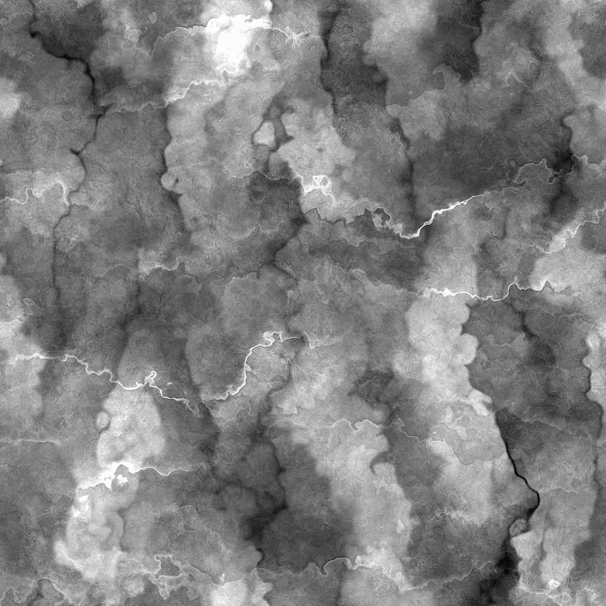

# Grunge Galvanic Large

<table>
<tr style="border: 0;">
<td width="41.60%" style="border: 0;" valign="top">

{width="200px"}

**In:** *Texture Generators**/Noises*

**Simple**

</td>
<td width="58.30%" style="border: 0;" valign="top">

## Description

The **Grunge Galvanic Large** node generates a grunge map akin to the pattern of galvanised steel.

</td>
</tr>
</table>

## Parameters

* **Balance** *Float*Adjusts the balance between dark and bright values.
* **Contrast** *Float*Adjusts the contrast of the image.
* **Invert** *Boolean*Inverts the output of the image, using a `1-x` operation.
* **Non Square Expansion** *Boolean*Enables compensation of squash and stretch with non-square ratios.
* Advanced
  * **Warp Intensity** *Float*Adjusts the intensity of the main warping effect.
  * **Ridge Detail Opacity** *Float*Adjusts the opacity of the brighter ridges.
  * **Sharpen Intensity** *Float*Adjusts the intensity of the global sharpening effect.

## Example Images

<table>
<tr style="border: 0;">
<td style="border: 0;" valign="top">

{width="256px"}

</td>
<td style="border: 0;" valign="top">

{width="256px"}

</td>
</tr>
</table>

 