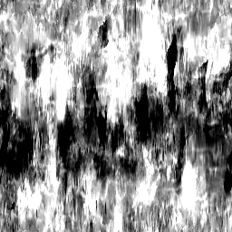
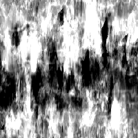

# Grunge Map 003

<table>
<tr style="border: 0;">
<td width="33.33%" style="border: 0;" valign="top">

{width="128px"}

<b>In:</b> Texture generators &gt; Noises

</td>
<td width="100.00%" style="border: 0;" valign="top">

## Description

This generates a complex, combined Noisemap. It can be very useful as a detailed procedural, but keep in mind these are very performance-intensive and thus slower to generate.

</td>
</tr>
</table>

## Parameters

|  |  |
|:---|:---|
| <b>Balance</b> <i>0.0 - 1.0</i> | Shifts the balance of the result between black or white, like a brightness adjustment. |
| <b>Contrast</b> <i>0.0 - 1.0</i> | Adjusts the contrast of the result. |
| <b>Invert</b> <i>False/True</i> | Inverts the result. |
| <b>Brush Pattern</b> <i>0.0 - 1.0</i> | Adds a mask around the edges, for when used as a brush alpha. |
| <b>Non Square Expansion</b> <i>False/True</i> | Enables compensation of squash and stretch with non-square ratios. |

## Examples

<table style="margin-top: 32px; margin-bottom: 32px">
    <tr style="border: 0">
        <td style="border: 0; background: transparent">
            
        </td>
    </tr>
</table>
