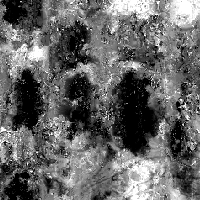

# Grunge Map 014

<table>
<tr style="border: 0;">
<td style="border: 0;" valign="top">

{width="128px"}

## Grunge Map 014

**In:** *Texture Generators**/Noises*

**Simple**

</td>
<td style="border: 0;" valign="top">

## Description

This generates a complex, combined Noisemap. It can be very useful as a detailed procedural, but keep in mind these are very performance-intensive and thus slower to generate.

## Parameters

* **Balance**: *0.0 - 1.0*
* **Contrast**: *0.0 - 1.0*
* **Invert**: *False/True*
* **Brush Pattern**: *0.0 - 1.0*  
  Adds a mask around the edges, for when used as a brush alpha.
* **Non Square Expansion**: *False/True*  
  Enables compensation of squash and stretch with non-square ratios.

## Example Images

</td>
</tr>
</table>
