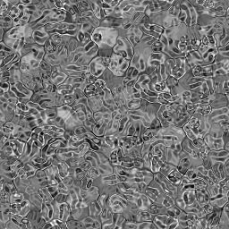
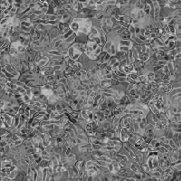

# Liquid

<table>
<tr style="border: 0;">
<td style="border: 0;" valign="top">

{width="128px"}

## Liquid

**In:** *Texture Generators**/Noises*

**Simple**

</td>
<td style="border: 0;" valign="top">

## Description

This is a simple variant of [Gaussian Noise](../gaussian-noise/gaussian-noise.md), which [warps](../../../../atomic-nodes/warp/warp.md) with itself to create a liquid-like effect.

## Parameters

* **Scale**: *1 - 128*  
  Sets the global scale for the effect.
* **Disorder**: *0.0 - 1.0*  
  Phase-shifts the noise to introduce small variation
* **Warp Intensity**: *0.0 - 1.0*  
  Sets the intensity of the warp effect.
* **Non Square Expansion**: *False/True*  
  Enables compensation of squash and stretch with non-square ratios.

## Example Images

</td>
</tr>
</table>
