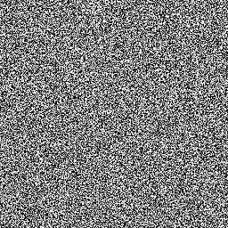

# White Noise Fast

<table>
<tr style="border: 0;">
<td width="33.33%" style="border: 0;" valign="top">

{width="128px"}

<b>In:</b> Texture Generators &gt; Noises

</td>
<td width="100.00%" style="border: 0;" valign="top">

## Description

This is a faster version of [White Noise](../../../../../../compositing-graphs/nodes-reference-for-com/node-library/texture-generators/noises/white-noise/white-noise.md), for when quality isn't your biggest concern and you want to save a bit on performance. In most cases, you should be fine with this fast version.

</td>
</tr>
</table>

## Examples

<table style="margin-top: 32px; margin-bottom: 32px">
    <tr style="border: 0">
        <td style="border: 0; background: transparent">
            
        </td>
    </tr>
</table>
