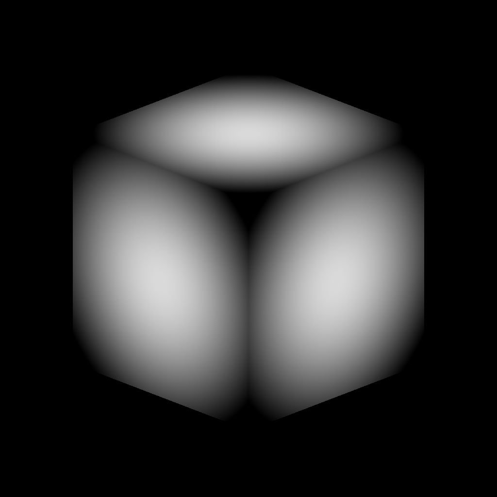

# 3D Volume Mask

<table>
<tr style="border: 0;">
<td width="41.60%" style="border: 0;" valign="top">

{width="256px"}

**In:** Generator*/Pattern*

**Simple**

</td>
<td width="58.30%" style="border: 0;" valign="top">

## Description

The **3D Volume Mask** node generates a representation of a *primitive shape* based on the **Position** input map.

</td>
</tr>
</table>

## Parameters

### Inputs

* **Position** *Color*  
  The map describing the *3D space coordinates* the primitive is represented into.  
  The **X/Y/Z** coordinates are mapped to the **R/G/B** channels respectively.

### Parameters

* **Shape** *Integer*  
  The primitive shape which should be represented:  
  * *Cube*- *Cylinder*- *Sphere*
* **Scale** *Float*  
  Defines the *global* scale of the primitive, applied *uniformly* on all axes.
* **Size** *Float3*  
  Defines the size of the shape on each axis.
* **Position Input** *Integer*  
  The method of *representing space* through the **Position** input:  
  * *UV Position*: Use a *UV map*. The X/Y (U/V) coordinates are mapped to the R/G channels respectively. The Z axis is assumed to be the *orthogonal forward* vector.  
  * *World Space Position*: Use a *position map* to map the primitive in 3D space. The X/Y/Z coordinates are mapped to the R/G/B channels respectively.
* **Position UV** *Float2*  
  The position of the primitive in UV space.  
  *Note*: This parameter is only available when the **Position Input** parameter is set to *UV Position*.
* **Position** *Float3*  
  The position of the primitive in world space.  
  *Note*: This parameter is only available when the **Position Input** parameter is set to *World Space Position*.
* **Rotation** *Float3*  
  Defines the rotation of the shape in world space.
* **Feather Width** *Float*  
  Adjusts the width of the *fading gradient* from the primitive's surface inwards.

## Example Images

<table>
<tr style="border: 0;">
<td style="border: 0;" valign="top">

{width="256px"}

</td>
<td style="border: 0;" valign="top">

{width="256px"}

</td>
<td style="border: 0;" valign="top">

{width="256px"}

</td>
<td style="border: 0;" valign="top">

{width="256px"}

</td>
</tr>
</table>
