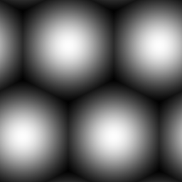

# Alveolus

<table>
<tr style="border: 0;">
<td style="border: 0;" valign="top">

{width="128px"}

## Alveolus

**In:** *Texture Generators**/Patterns*

**Simple**

</td>
<td style="border: 0;" valign="top">

## Description

A soft-sphere pattern that can altenatively generate hexagon tiles.

## Parameters

* **Tiling**: *1 - 16*  
  Sets the amount of times the result should tile.
* **Gradient Filled Cells**: *False/True*Switches to sharp edges, making sharp-edged hexagon tiles.
* **Interstice Width**: *0.0 - 1.0*Only works when the above option is set to "False". Changes interstice size.
* **Non Square Expansion**: *False/True*  
  Enables compensation of squash and stretch with non-square ratios.

## Example Images

</td>
</tr>
</table>
