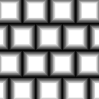

# Brick Generator

<table>
<tr style="border: 0;">
<td width="33.33%" style="border: 0;" valign="top">

{width="128px"}

<b>In:</b> Texture Generators &gt; Patterns

</td>
<td width="100.00%" style="border: 0;" valign="top">

## Description

Advanced Brick-pattern generator. Has a lot of options for specifically generating man-made brick patterns

For more options see [Tile Generator](../../../../../../compositing-graphs/nodes-reference-for-com/node-library/texture-generators/patterns/tile-generator/tile-generator.md).

</td>
</tr>
</table>

## Parameters

|  |  |
|:---|:---|
| <b>Bricks</b> <i>1 - 64</i> | Sets the amount of bricks in both X- and Y-axes. |
| <b>Bevel</b> <i>0.0 - 1.0</i> | Changes the bevel profile for the bricks, allows for changing in two directions as well as setting falloff profile and corner rounding. |
| <b>Keep Ratio</b> <i>False/True</i> | Makes the Bevel profile tied to brick size or not. |
| <b>Gap</b> <i>0.0 - 1.0</i> | Gap to leave between bricks. Keep in mind Bevel also introduces a gap, so setting bevels too means you have to compensate with this parameter. |
| <b>Middle Size</b> <i>0.0 - 1.0</i> | Brick pattern offset, changes size of every other column or row. |
| <b>Height</b> <i>-1.0 - 1.0</i> | Modifies height profiles. Allows for introduction of Luminance variation and all kinds of randomisation. |
| <b>Slope</b> <i>-1.0 - 1.0</i> | Introduces a slope on a per-brick basis, as if certain bricks are lying at an angle. |
| <b>Offset</b> <i>0.0 - 1.0</i> | Offsets bricks on a row-basis, affects per-row spacing. |
| <b>Non Square Expansion</b> <i>False/True</i> | Enables compensation of squash and stretch with non-square ratios. |

## Examples

<table style="margin-top: 32px; margin-bottom: 32px">
    <tr style="border: 0">
        <td style="border: 0; background: transparent">
            
        </td>
        <td style="border: 0; background: transparent">
            
        </td>
    </tr>
</table>
