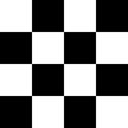

# Checker 1

<table>
<tr style="border: 0;">
<td style="border: 0;" valign="top">

{width="128px"}

## Checker 1

**In:** *Texture Generators**/Patterns*

**Simple**

</td>
<td style="border: 0;" valign="top">

## Description

Very simple Checker pattern. Tiling is deliberately set low to make it as generic as possible.

It is a useful pattern for test cases, due to its obvious contrast and tiling.

## Parameters

* **Tiling**: *1 - 16*  
  Sets the amount of times the result should tile.
* **Rotate 45 Degrees**: *False/True*Rotates the whole pattern 45 degrees.
* **Non Square Expansion**: *False/True*  
  Enables compensation of squash and stretch with non-square ratios.

## Example Images

</td>
</tr>
</table>

 