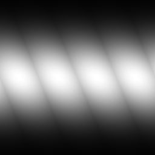

# Fibers 1

<table>
<tr style="border: 0;">
<td width="33.33%" style="border: 0;" valign="top">

{width="128px"}

<b>In:</b> Texture Generators &gt; Patterns

</td>
<td width="100.00%" style="border: 0;" valign="top">

## Description

Simple fiber-like pattern. Can be used in  [Substance 3D Designer](https://www.adobe.com/products/substance3d-designer.html) for rope, mesh or cloth Heightmaps and details.

</td>
</tr>
</table>

## Parameters

|  |  |
|:---|:---|
| <b>Tiling</b> <i>1 - 16</i> | Sets the amount of times the result should tile. |
| <b>Non Square Expansion</b> <i>False/True</i> | Enables compensation of squash and stretch with non-square ratios. |

## Examples

<table style="margin-top: 32px; margin-bottom: 32px">
    <tr style="border: 0">
        <td style="border: 0; background: transparent">
            
        </td>
    </tr>
</table>
