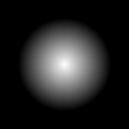

# Gradient Radial

<table>
<tr style="border: 0;">
<td style="border: 0;" valign="top">

{width="128px"}

## Gradient Radial

**In:** *Texture Generators**/Patterns*

**Simple**

</td>
<td style="border: 0;" valign="top">

## Description

Similar to [Gradient Circular](../../../../../../help/compositing-graphs/nodes-reference-for-com/node-library/texture-generators/patterns/gradient-circular/gradient-circular.md), creates a grayscale gradient transition defined by two custom points in a radial fashion. The transition is from a to b, defined by centerpoint and radius. Keep in mind results will not always tile.

## Parameters

* **Shape: *Cone, Hemisphere***Determines transition profile. Cone is a sharp, linear transition, Hemisphere is soft and rounded in the centre.
* **Point 1**:   
  Center point of the gradient. Starts white.
* **Point 2**:   
  Radius point to determine extent of gradient. Ends black.
* **Non Square Expansion**: *False/True*  
  Enable compensation of squash and stretch with non-square ratios.

</td>
</tr>
</table>
