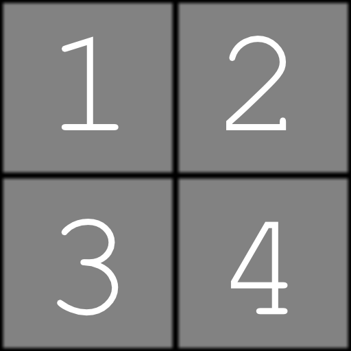

# Grid atlas grayscale

<table>
<tr style="border: 0;">
<td width="33.33%" style="border: 0;" valign="top">

<b>In:</b> Generator &gt; Pattern

</td>
<td width="100.00%" style="border: 0;" valign="top">

## Description

Pack up to 16 grayscale images on a grid of adjustable XY size. The output atlas image can be sampled from by a [Shape splatter v2](../shape-splatter-v2/shape_splatter_v2.md) or a [Shape splatter mapper grayscale](../shape-splatter-v2-mapper-grayscale/shape_splatter_v2_mapper_grayscale.md) node.

See also [Grid atlas color](../grid_atlas_color/grid_atlas_color.md).

</td>
</tr>
</table>

## Inputs

|                             |                                |
|:----------------------------|:-------------------------------|
| <b>Input 1</b> *Grayscale*  | The grayscale image input #1.  |
| <b>Input 2</b> *Grayscale*  | The grayscale image input #2.  |
| <b>Input 3</b> *Grayscale*  | The grayscale image input #3.  |
| <b>Input 4</b> *Grayscale*  | The grayscale image input #4.  |
| <b>Input 5</b> *Grayscale*  | The grayscale image input #5.  |
| <b>Input 6</b> *Grayscale*  | The grayscale image input #6.  |
| <b>Input 7</b> *Grayscale*  | The grayscale image input #7.  |
| <b>Input 8</b> *Grayscale*  | The grayscale image input #8.  |
| <b>Input 9</b> *Grayscale*  | The grayscale image input #9.  |
| <b>Input 10</b> *Grayscale* | The grayscale image input #10. |
| <b>Input 11</b> *Grayscale* | The grayscale image input #11. |
| <b>Input 12</b> *Grayscale* | The grayscale image input #12. |
| <b>Input 13</b> *Grayscale* | The grayscale image input #13. |
| <b>Input 14</b> *Grayscale* | The grayscale image input #14. |
| <b>Input 15</b> *Grayscale* | The grayscale image input #15. |
| <b>Input 16</b> *Grayscale* | The grayscale image input #16. |

## Outputs

|               |                                  |
|:--------------|:---------------------------------|
| <b>Output</b> | The output grayscale grid atlas. |

## Parameters

|                                   |                                                                                                                                                                                                                                                                                                                                                                    |
|:----------------------------------|:-------------------------------------------------------------------------------------------------------------------------------------------------------------------------------------------------------------------------------------------------------------------------------------------------------------------------------------------------------------------|
| <b>Grid size X</b> *Integer*      | The size of the grid on the X axis. I.e. the number of images being packed on the X axis.                                                                                                                                                                                                                                                                       |
| <b>Grid size Y</b> *Integer*      | The size of the grid on the Y axis. I.e. the number of images being packed on the Y axis.                                                                                                                                                                                                                                                                       |
| <b>Output size mode</b> *Integer* | The method of defining the size of the output image according to the node's 'Output size' base parameter:  - <b>Manual:</b> Use the size as is. - <b>Automatic ratio:</b> Adjust the image ratio according to the grid size in order to minimise the image size. Deformation will occur for non-square grids using 3 rows or columns, e.g. (3, 2), (4, 3) |
