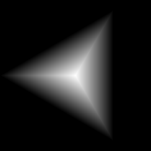

# Polygon 2

<table>
<tr style="border: 0;">
<td style="border: 0;" valign="top">

{width="128px"}

## Polygon 2

**In:** *Texture Generators**/Patterns*

**Intermediate**

</td>
<td style="border: 0;" valign="top">

## Description

Generates a smooth gradient polygon shape with options for adjustment. See [Polygon 1](../../../../../../help/compositing-graphs/nodes-reference-for-com/node-library/texture-generators/patterns/polygon-1/polygon-1.md) for a more advanced version.

## Parameters

* **Sides**: *3 - 32*Amount of sides.
* **Scale**: *0.0 - 1.0*Sets global scale.
* **Rotation**: *0.0 - 1.0*Rotates entire shape.
* **Curve**: *-1.0 - 1.0*Modifies the gradient profile curve.
* **Gradient**: *0.0 - 1.0*Adjusts gradient contrast.
* **Invert Gradient**: *False/True*Inverts gradient direction.
* **Auto Scale**: *False/True*Scales to fit in canvas with default settings.
* **Non Square Expansion**: *False/True*  
  Enables compensation of squash and stretch with non-square ratios.

## Example Images

</td>
</tr>
</table>
