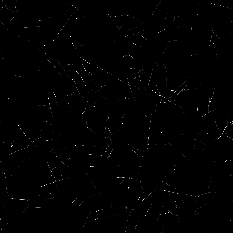

# Scratches Generator

<table>
<tr style="border: 0;">
<td style="border: 0;" valign="top">

## Scratches Generator (Normal)

**In:** *Texture Generators**/Patterns*

**Complex**

</td>
<td style="border: 0;" valign="top">

## Description

This places random scratches with a lot of customisation options, for example allowing you to set direction, spread and distortion.

There's a special version of Scratches Generator, Scratches Generator Normal, which generates Normalmaps based on the depth of these scratches. Most options are exactly the same, but it has a few extra parameters clearly marked for Normal settings (see below).

## Parameters

* **Spline Number**: *1 - 512*Amount of scratches (splines) to place.
* **Max Segments Per Spline**: *2 - 256*Amount of segments/subdivisions over the length of a scratch. Leads to smoother curves and distortions. The effect is more noticeable with higher Distortion values.
* **Spline Rotation**: *0.0 - 1.0*Uniform rotation of all splines, to orient them in a direction.
* **Spline Rotation Random**: *0.0 - 1.0*Variation of angle, randomly rotates every spline.
* **Spline Scale**: *0.0 - 1.0*Uniformly scales all splines.
* **Spline Scale Random**: *0.0 - 1.0*Randomly scales each spline individually.
* **Spline Distortion**: *0.0 - 1.0*Uniform distortion level across all splines.
* **Spline Distortion Random**: *0.0 - 1.0*Randomises the level of distortion of each spline individually.
* **Spline Distortion Frequency**: *0.0 - 1.0*Sets the frequency of distortion, controls the scale of distortion detail.
* **Spline Width**: *0.0 - 2.0*Sets the width of all splines uniformly.
* **Spline Width Random**: *0.0 - 1.0*Randomises the spline width of each spline individually.
* **Spline Position Random**: *0.0 - 1.0*Randomises the position of each spline individually. The lower this value, the more splines will cluster to the center of the canvas. Can be used to create spots of scratches.
* **Set Spline Width in px**: *False/True*Determines the units used for spline width settings.
* **Luminance Random (Grayscale version only)**: *0.0 - 1.0*Randomises the Luminance of each spline individually.
* **Normal Intensity (Normal version only)**: *0.0 - 1.0*Sets the strength of the Normal effect for every spline globally.
* **Normal Intensity Random **(Normal version only)****: *0.0 - 1.0*Randomises the normal strength for each spline individually.
* **Normal Format **(Normal version only)****: *DirectX, OpenGL*  
  Switches between different Normalmap formats (inverts the green channel).
* **Fade Mode**: *None, Start, End, Start + End*Sets whether and in what direction the splines fade.
* **Fade Length**: *0.0 - 1.0*Sets the length of the fade effect, if enabled above.
* **Non Square Expansion**: *False/True*  
  Enables compensation of squash and stretch with non-square ratios.

## Example Images

| 

 | 

 |
| --- | --- |
|  |  |

</td>
</tr>
</table>
