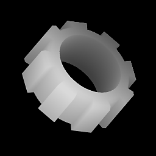

# Shape Extrude

<table>
<tr style="border: 0;">
<td width="33.33%" style="border: 0;" valign="top">

{width="128px"}

<b>In:</b> Texture Generators &gt; Patterns

</td>
<td width="100.00%" style="border: 0;" valign="top">

## Description

An advanced node that allows 2d, binary "shape" inputs to be rendered to 3D-rotated heightmaps. Works similar like an extrude in a 3D package where a shape is extruded along it's axis, creating a volume. In combination with the Profile Gradient Mask, Revolution/Lathe-type bodies can be created as well. Very useful for creating complex artifcial shapes for heightmaps.

</td>
</tr>
</table>

## Inputs

|  |  |
|:---|:---|
| <b>Extrude Shape Input</b> <i>Grayscale Input</i> | If Extrude Shape is set to Custom, you plug in your own (preferably) Binary shape mask here. |
| <b>Profile Gradient</b> <i>Grayscale Input</i> | If Profile Type is set to Vertical Gradient, can be used to define scale of the shape along the axis, for Revolution bodies. |
| <b>Profile Mask</b> <i>Grayscale Input</i> | Mask slot used for hiding or showing the Extruded shape along it's axis. Can be used to break continuity of the shape along its axis. Only interpreted as Binary: grayscale put values are rounded to 0 or 1. |

## Parameters

|  |  |
|:---|:---|
| <b>Extrude Height</b> <i>0.0 - 1.0</i> | Amount to extrude shape by upwards from center. |
| <b>Extrude Depth</b> <i>0.0 - 1.0</i> | Amount to extrude shape by downwatds from center. |
| <b>Extrude Shape</b> <i>Cube, Cylinder, Custom Input</i> | Use either built-in shapes or input your own Custom shape externally. |
| <b>Extrude Shape Size</b> <i>0.0 - 1.0</i> | Only used with Built-In Cube and Cylinder, determines base shape size, can be scaled non-uniform. |
| <b>Scale</b> <i>0.0 - 1.0</i> | Set the global scale for the effect. With Built-In Shapes this is a uniform base shape scale, and does not affect Height or Depth.  With Custom Input this scales the entire final result in a uniform way. |
| <b>Profile Type</b> <i>Straight, Vertical Gradient, Mask</i> | Main control to determine behaviour of effect and use of optional extra input maps.  Straight is standard Extrusion behaviour, Vertical Gradient allows custom scale values along entire axis, Mask allows hiding sections along axis by mask. |
| <b>Bevel Height</b> <i>0.0 - 1.0</i> | Set how far the bevel reaches along extrusion axis. |
| <b>Bevel Intensity</b> <i>0.0 - 1.0</i> | Set how much the bevel retracts from original shape. |
| <b>Bevel Curve</b> <i>-1.0 - 1.0</i> | Set convex or concave curve of Bevel effect. A value of 0 means straight, no curve. |
| <b>Mirror Bevel</b> <i>False/True</i> | Toggle to apply Bevel on top as well as bottom of shape. |
| <b>Downscale Mulitplier</b> <i>0 - 2</i> | Built-in easy downscaling control. Can be used to quickly add Anti-Aliasing; make sure to increase node resolution as well. |
| <b>Position</b> | Main control for rotating result in 3D space. Correlates with interavtice Gizmo in the 2D view. |
| <b>Output Range</b> <i>&#91;0, 1&#93;, &#91;-1, 1&#93;</i> | Set output min and max values. If range is set to &#91;-1,1&#93;, negative values are presented as black. |

## Examples

<table style="margin-top: 32px; margin-bottom: 32px">
    <tr style="border: 0">
        <td style="border: 0; background: transparent">
            
        </td>
    </tr>
</table>
