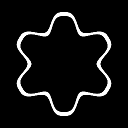

# Shape mapper

<table>
<tr style="border: 0;">
<td style="border: 0;" valign="top">

<table>
<tr style="border: 0;">
<td width="33.33%" style="border: 0;" valign="top">

{width="200px"}

<b>In:</b> Texture generators &gt; Patterns

</td>
<td width="100.00%" style="border: 0;" valign="top">

## Description

Projects an input image along a circle or polygon.

The projection deforms the image to follow the shape's outline, and make it fit exactly a specified amount of times without gaps.

</td>
</tr>
</table>

<table>
<tr style="border: 0;">
<td style="border: 0;" valign="top">

</td>
<td style="border: 0;" valign="top">

</td>
<td style="border: 0;" valign="top">

</td>
<td style="border: 0;" valign="top">

</td>
</tr>
</table>

## Inputs

|  |  |
| --- | --- |
| <b>Input</b> *Grayscale* | The pattern which should be placed along the shape. |

## Outputs

|  |  |
| --- | --- |
| <b>Output</b> *Grayscale* | The result of the projection of the pattern along the shape, as a grayscale bitmap. |

## Parameters

|  |  |
| --- | --- |
| <b>Shape</b>  Integer | Sets the type of shape along which patterns should be placed:<ul data-preserve-html="true"> <li data-preserve-html="true">Circle</li> <li data-preserve-html="true">Polygon</li> </ul> |
| <b>Pattern amount</b>  Integer | The amount of patterns placed along the selected shape. |
| <b>Link segments with pattern amount</b>  Boolean   *Available when 'Shape' is set to 'Polygon'* | Use the <b>Pattern amount</b> as the number of <b>Segments</b>.   This prevents patterns from wrapping around corners, ensuring a straight and consistent aspect. |
| <b>Segments</b>  Integer   *Available when 'Shape' is set to 'Polygon' and 'Link segements with pattern amount' is set to 'False'* | The amount of segments for the polygon along which patterns are placed.   Segments are *evenly sized*, and all vertices are *equidistant from the center*, such that increasing the amount of segments makes the polygon converge towards a circle. |
| <b>Radius</b>  Float | A multiplier for the radius of the shape, where 1.0 is half the length of the image's shortest side. |
| <b>Width</b>  Float | A multiplier for the width of the patterns along the shape, where 1.0 is half the length of the image's shortest side. |
| <b>Rotation</b>  Float | The amount of rotation applied to the shape, in number of turns clockwise from the horizontal right. |
| <b>Flip one on two</b>  Boolean | Flip one every other shape vertically. |
| <b>Filtering mode</b>  Integer | The method of filtering applied to the patterns placed along the shape:<ul data-preserve-html="true"> <li data-preserve-html="true"><i>Nearest:</i> Applies the value from the closest projected pixel as-is, resulting in a crisper yet aliased look.</li> <li data-preserve-html="true"><i>Bilinear:</i> Applies a bilinear filter to interpolate the projected pixel with its neighbors, for a smoother yet blurrier look.</li> </ul> |
| <b>Non-square expansion</b>  Boolean | In non-square images, keeps the generated shape square and expands the image generation to the image's bounds. |

## Examples

<table>
<tr style="border: 0;">
<td style="border: 0;" valign="top">

</td>
<td style="border: 0;" valign="top">

</td>
</tr>
</table>

</td>
<td style="border: 0;" valign="top">

</td>
<td style="border: 0;" valign="top">

</td>
</tr>
</table>

 