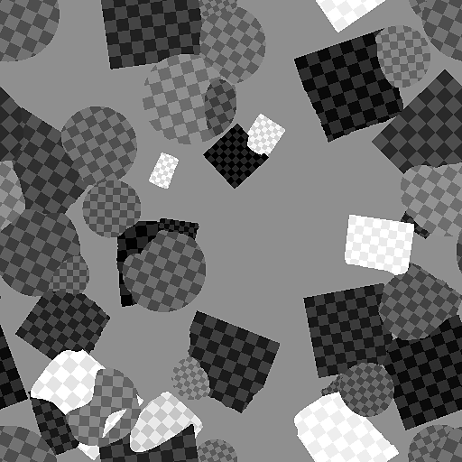

# Shape Splatter Blend

<table>
<tr style="border: 0;">
<td style="border: 0;" valign="top">

{width="128px"}

## Shape Splatter Blend (Color)

**In:** *Texture Generators**/Patterns*

**Complex**

</td>
<td style="border: 0;" valign="top">

## Description

Takes [Shape Splatter](../../../../../../compositing-graphs/nodes-reference-for-com/node-library/texture-generators/patterns/shape-splatter/shape-splatter.md) Data as input to generate color or grayscale maps from.

## Parameters

* **Background Color**: *Color Input*
* **Pattern 1-8**: *Color Input*
* **Color Input**: *Color Input*
* **Splatter Data 1**: *Color Input*
* **Splatter Data 2**: *Color Input*

### Parameters

* **Pattern Number**: *1 - 8*
* **Random Pattern Assignment (Color Only)**: *0.0 - 1.0*
* **Is Normal Map **(Color Only)****: *False/True*
* **HSL/Luminance Adjustment**: *-1.0 - 1.0*
* **HSL/Luminance Random**: *-1.0 - 1.0*
* **Normal Angle Random **(Color Only)****: *0.0 - 1.0*
* **Color Input Opacity**: *0.0 - 1.0*

## Example Images

</td>
</tr>
</table>
