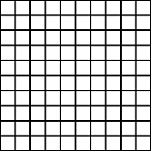
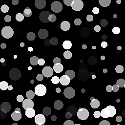

# Tile Generator

<table>
<tr style="border: 0;">
<td style="border: 0;" valign="top">

{width="128px"}

## Tile Generator (Color)

**In:** *Texture Generators**/Patterns*

**Complex**

</td>
<td style="border: 0;" valign="top">

## Description

Tile generator is one of the most advanced nodes in the library. If you learn to master it, you can create any kind of pattern (within some limitations). As of Version 2017 2.1 there have been some big updates, bringing this node more in line with what [Tile Sampler](../../../../../../compositing-graphs/nodes-reference-for-com/node-library/texture-generators/patterns/tile-sampler/tile-sampler.md) can do.

This node is highly useful for a variety of scenarios, but keep in mind that simply reading parameters will not fully teach you how to use them. We suggest you experiment too!

For 99% of all cases, the color version is NOT needed!

Some general usage tips:

* You can start with a basic shape, but if you have a custom input (Set **Pattern Type** to *Image Input*), create it first! It determines a lot of the look.
* Start by correctly setting your X and Y amounts.
* Find the right **Size** mode: Relative modes like **Interstice** behave quite different from **Absolute** modes.
* Adjust global **Scale** and non-uniform **Size** next.
* Finally, tweak any **"Variation"** parameter until it meets your needs. Subtlety is key with variation!

## Parameters

### Inputs

* **Pattern Input 1-6**: *Grayscale Input*  
  Custom pattern image, used when the "Pattern" parameter is set to "Image Input".
* **Background**:*Grayscale Input*Background to use instead of solid color.

### Parameters

* **X Amount**: *1 - 64*  
  Amount of X-repetitions of the pattern.
* **Y Amount**: *1 - 64*  
  Amount of Y-repetitions of the pattern.
* **Non Square Expansion**: *False/True*  
  Enables compensation of squash and stretch with non-square ratios.
* **Pattern**   
  * **Pattern**: *Image Input, Square, Disc, Paraboloid, Bell, Gaussian, Thorn, Pyramid, Brick, Gradation, Waves, Half Bell, Ridged Bell, Crescent, Capsule, Cone*  
    Selects which pattern shape to use.
  * **Pattern Input Number**: *1 - 6*Number of different Image inputs to use. Only available when *Image Input* is selected above.
  * **Pattern Input Distribution**: *Random, By Pattern Number*How to pick between the different Image Inputs, if more than 1 is selected.
  * **Pattern Specific**: *0.0 - 1.0*  
    Lets you change the selected pattern's shape. Effect is dependent on selected pattern.
  * **Image Input Filtering (Engine &gt;v4 only)**: *Bilinear + Mipmaps, Bilinear, Nearest*
  * **Rotation**: *0, 90, 180, 270*Rotates all tiles globally by a set angle in 90 degree steps.
  * **Rotation Random**: *0.0 - 1.0*Randomy rotates a tile by one of four 90 degree steps.
  * **Quincunx Flip**: *False/True*Rotates every other tile by 90 degrees.
  * **Symmetry Random**: *0.0 - 1.0*Randomly mirrors certain patterns by the selected Symmetry random Mode. The higher this value, the more patterns will be mirrored.
  * **Symmetry Random Mode**: *Horizontal + Vertical, Horizontal, Vertical*Determines mirroring behaviour when Symmetry random is higher than 0.
* **Size**   
  * ****Size Mode**:***Normal - Interstice, Normal - Size, Keep Ratio, Absolute, Pixel*Sets general behavior of the pattern size.  
    Normal - Interstice lets you define the gap between the pattern elements. It is affected by the X and Y amount.  
    Normal - Size lets you define the size of the pattern elements, irrespective of the gap. It is affected by the X and Y amount.  
    Keep Ratio lets you set a size affected by X and Y amount, but the X and Y ratio between the two is left intact.  
    Absolute lets you set an absolute size that is not affected by X and Y amount.  
    Pixel lets you set an absolute size in pixels, unaffected by X and Y amount. Changing the resolution will affect the size of the elements.
  * **Middle Size**: *0.0 - 1.0*Changes size on an alternating column- and row-basis.
  * **Interstice X/Y**: *0.0 - 1.0*Only available in Normal - Interstice Size mode. Changes interstice gap. Affects the seam between shapes, allows for non-uniform control unlike **Scale**.
  * **Size (Absolute/Pixel)**: *0.0 - 1.0*  
    Only available outside of Normal - Interstice size mode. Sets non-uniform size, unlike **Scale**.
  * **Scale**: *0.0 - 2.0*Sets global Scale.
  * **Scale Random**: *0.0 - 1.0*Sets global scale variation per-tile.
  * **Scale Random Seed**: *0 - 1000*Offsets scale variation seed.
* **Position**   
  * **Offset**: *0.0 - 1.0*Offsets the entire pattern incrementally over every consecutive row or column (behaviour depends on Vertical Offset parameter).
  * **Offset Random**: *0.0 - 1.0*Randomises line offsetting.
  * **Offset Random Seed**: *0 - 1000*Changes the relative seed for the random offsetting effect.
  * **Vertical Offset**: *False/True*Sets whether Offset effect happens over rows or lines; Horizontal or Vertical.
  * **Position Random**: *0.0 - 1.0*Randomises position in a non-uniform way, with separate control for X and Y.
  * **Global Offset**: *0.0 - 1.0*Shifts the entire result over both X- and Y-axes.
* **Rotation**   
  * **Rotation**: *0.0 - 1.0*Does a uniform free Rotation of all pattern tiles.
  * **Rotation Random**: *0.0 - 1.0*Randomises free rotation of all tiles. The higher this value, the more tiles can be rotated.
* **Color**   
  * **Color**: *(Grayscale value)*Sets tile solid color.
  * **Luminance/Color Random**: *0.0 - 1.0*Introduces per-tile Color or Luminance variation.
  * **Luminance By Number**: *False/True*Fades Luminance over the entire pattern.
  * **Luminance By Scale**: *False/True*Makes Luminance variation dependent on tile scale.
  * **Checker Mask**: *False/True*Hides every other tile.
  * **Horizontal Mask**: *False/True*Hides every other column.
  * **Vertical Mask**: *False/True*Hides every other row.
  * **Random Mask**: *0.0 - 1.0*Randomly hides tiles. The higher this value, the more tiles will disappear.
  * **Invert Mask**: *False/True*Inverts the result of any masking effects from this section.
  * **Blending Mode**: *Add, Max, Add Sub*Sets what blending mode to use.
  * **Background Color**: *(Grayscale value)*Sets solid background color.
  * **Global Opacity**: *0.0 - 1.0*Sets global tiles opacity.
  * **Reverse Rendering Order**: *False/True*Renders tiles back to front or vice-versa.

## Example Images

</td>
</tr>
</table>
