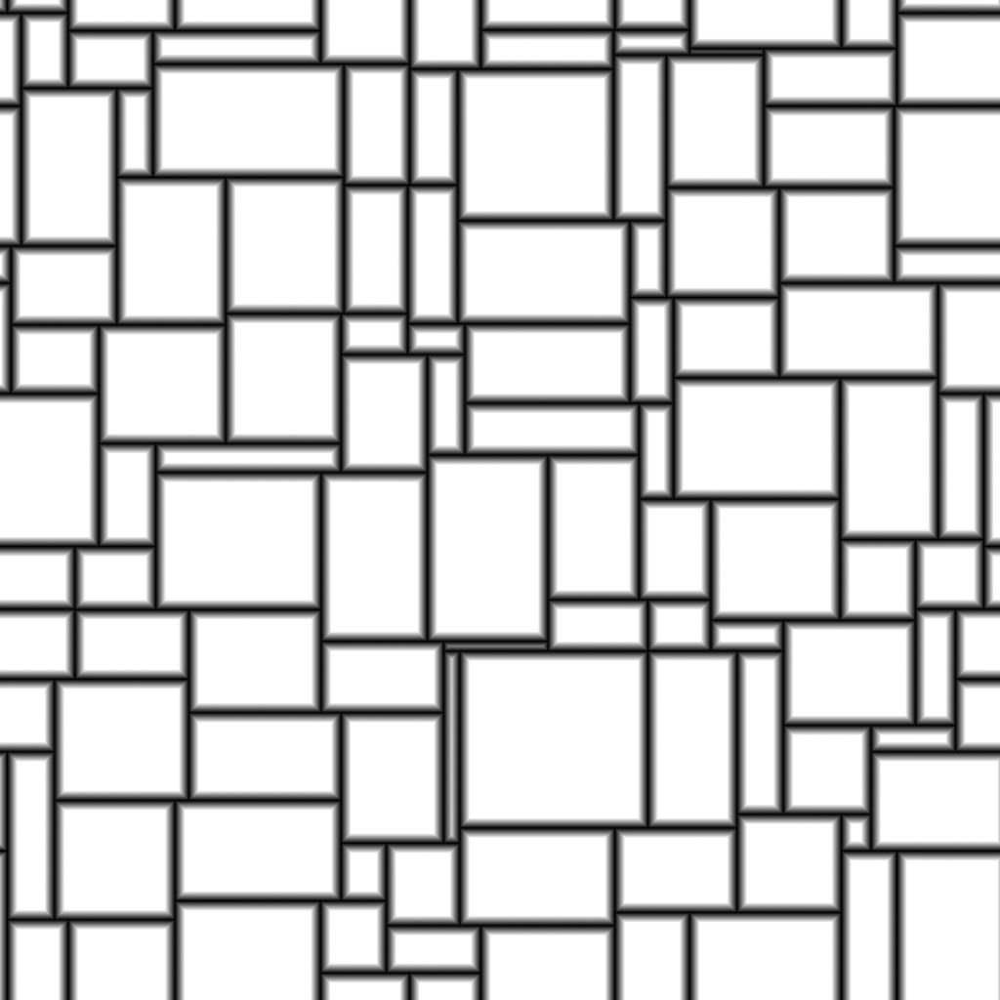

# Tile Random 2

<table>
<tr style="border: 0;">
<td width="41.60%" style="border: 0;" valign="top">

{width="200px"}

**In:** *Texture Generators* */Patterns*

**Complex**

</td>
<td width="58.30%" style="border: 0;" valign="top">

## Description

The **Tile Random 2** node generates adjacent tiles of random sizes and height-to-width ratios.

The grid may be tweaked by randomly *slanting* the sides of the shapes to break up the angles.

Shapes may be adjusted with options for *scaling*, *bevelling*, *rounding of the corners* as well as *disorted rotation*.

These adjustments may be controlled by *input maps*.

A dedicated output lets you input the shape's **UVs** into **Flood Fill to (...)** nodes for applying additional variation.

</td>
</tr>
</table>

## Parameters

### Inputs

* **Random Size Map** *Grayscale*  
  The grayscale input image which controls the random scale of the shapes.  
  Its impact is controlled by the **Random Size Input Map Multiplier** parameter.
* **Random Slant Map** *Grayscale*The grayscale input image which controls the random slanting of the shapes.  
  Its impact is controlled by the **Random Slant Input Map Multiplier** parameter.
* **Round Corners Radius Map** *Grayscale*  
  The grayscale input image which controls the radius of the shapes' rounded corners.  
  Its impact is controlled by the **Round Corners Radius Input Map Mult.** parameter.
* **Bevel Distance Map** *Grayscale*  
  The grayscale input image which controls the bevelling of the shapes.  
  Its impact is controlled by the **Bevel Distance Input Map Mult.** parameter.
* **Mask Map** *Grayscale*  
  The grayscale input image which controls the masking of the shapes.  
  Its impact is controlled by the **Mask Map Input Start** and **Mask Map Input End** parameters.

### Parameters

* **Amount X** *Integer*  
  The number of cells on the **X** axis.
* **Amount Y** *Integer*  
  The number of cells on the **Y** axis.
* Size
  * **Random Size Multiplier** *Float*  
    Applies a *global* adjustment to the intensity of the random scaling.
  * **Random Size Input Map Multiplier** *Float*  
    Adjusts the intensity of the random scaling using the values *sampled* from the **Random Size Map** input.
  * **Random Size X** *Float*  
    Adjusts the intensity of the random scaling on the **X** axis *only*.
  * **Random Size Y** *Float*  
    Adjusts the intensity of the random scaling on the **Y** axis *only*.
  * **Random Size Distribution** *Integer*  
    Controls the method of distributing random scaling values:  
    * *Uniform*: the random scale is applied the *same way* on all cells  
    * *Blue Noise*: the random scale is *adjusted* using a blue noise pattern
* Shape Aspect - Transform
  * **Interstice Thickness** *Float*Adjusts the thickness of the gap between shapes. It is *equal for all* shapes.
  * **Random Position Multiplier** *Float*  
    Applies a random position offset to the shape up to it *meeting its cell's border*.
  * **Round Corners Radius** *Float*Adjusts the *radius* of the rounded corners of the shapes. A value of **0** means no rounding is applied.  
    *Note*: This effect cannot be applied when the **Enable per Axis Bevel Control** parameter is set to *True*.
  * **Round Corners Radius Input Map Mult.** *Float*Adjusts the intensity by which the **Round Corners Radius Map** input map impacts the radius of the rounded corners.  
    The map acts as a *per-pixel* multiplier for the **Round Corners Radius** parameter.  
    *Note*: This effect cannot be applied when the **Enable per Axis Bevel Control** parameter is set to *True*.
  * **Scale Multiplier** *Float*  
    Adjusts the size of each shape, as a proportion of the *area of its cell*.
  * **Scale Random** *Float*Adjusts the intensity by which a random scale is applied to *each* shape.
  * **Rotation** *Float*Rotates shapes in their cells by moving each *corner* to its *neighbour* along the cell's border.  
    This method results in some amount of *distortion* and *scaling* being applied to the shape at is rotates.
  * **Rotation Random** *Float*Adjusts the intensity by which a random amount of rotation is applied to each shape.  
    The method of rotation is described in the **Rotation** parameter.
  * **Corners Position Random** *Float*Distorts the shapes by applying a random amount of *offset* to each of their *corners* along their cell's border.
* Slant
  * **Random Slant Multiplier** *Float*  
    Applies a *global* adjustment to the intensity of the random slanting.
  * **Random Slant Input Map Multiplier** *Float*  
    Adjusts the intensity of the random slanting using the values *sampled* from the **Random Slant Map** input.
  * **Random Slant X** *Float*  
    Adjusts the intensity of the random slanting  
    on the **X** axis *only*.
  * **Random Slant Y** *Float*  
    Adjusts the intensity of the random slanting  
    on the **Y** axis *only*.
  * **Random Slant Distribution** *Integer*  
    Controls the method of distributing random slanting values:  
    * *Uniform*: the random slant is applied the *same way* on all cells  
    * *Blue Noise*: the random slant is *adjusted* using a blue noise pattern
* Bevel
  * **Bevel Distance Mode** *Integer*  
    Sets the method of *acquiring the distance* by which shapes should be beveled:  
    * *Relative to Grid Size*: Shapes are beveled by the specified *proportion of their grid size*- *Relative to Shape Size*: Shapes are beveled by the specified *proportion of their size*  
    * *Relative to Image Size*: Shapes are beveled by the specified *proportion of the image*
  * **Bevel Distance Multiplier** *Float*  
    Applies a *global* adjustment to the distance of the bevelling.
  * **Bevel Distance Input Map Mult.** *Float*  
    Adjusts the distance of the bevelling using the **Bevel Distance Map** input map as a *per-pixel* multiplier.
  * **Bevel Rounded Curve** *Float*  
    Adjusts the intensity of the rounding applied to the bevelling angle to make it more *convex*.
  * **Enable per Axis Bevel Control** *Boolean*  
    When *True*, bevelling can be applied and adjusted *separately* on the **X** and **Y** axes.  
    *Note*: This *cancels* the **Round Corners** effect.
  * **Bevel Distance X** *Float*  
    Adjusts the distance of the bevelling on the **X** axis *only*. This distance depends on the value of the **Bevel Distance Mode** parameter.  
    *Note*: This parameter is only available when the **Enable per Axis Bevel Control** parameter is set to *True*.
  * **Bevel Distance Y** *Float*  
    Adjusts the distance of the bevelling on the **Y** axis *only*. This distance depends on the value of the **Bevel Distance Mode** parameter.  
    *Note*: This parameter is only available when the **Enable per Axis Bevel Control** parameter is set to *True*.
* Mask
  * **Mask Random Invert** *Boolean*  
    Inverts the random masking of shapes.
  * **Mask Random Start** *Float*  
    For a given **Random Seed**, pseudo-random masking is applied following a *specific order* from a start shape to an end shape. This parameter lets you *offset the index* of the *start* shape.  
    *Note*: This determines one limit of a *value range* for masking. The value may therefore be *greater* than the **Mask Random End** value.
  * **Mask Random End** *Float*For a given **Random Seed**, pseudo-random masking is applied following a *specific order* from a start shape to an end shape. This parameter lets you *offset the index* of the *end* shape.  
    *Note*: This determines one limit of a *value range* for masking. The value may therefore be *greater* than the **Mask Random Start** value.
  * **Mask by Cell Area Invert** *Boolean*  
    Inverts the masking of shapes by the area of their cells.
  * **Mask by Cell Area Start** *Float*  
    Adjusts the *minimum* cell's area threshold for masking shapes.  
    *Note*: This determines one limit of a *value range* for masking. The value may therefore be *greater* than the **Mask by Cell Area End** value.
  * **Mask by Cell Area End** *Float*Adjusts the *maximum* cell's area threshold for masking shapes.  
    *Note*: This determines one limit of a *value range* for masking. The value may therefore be *lower* than the **Mask by Cell Area Start** value.
  * **Mask Map Input Invert** *Boolean*  
    Inverts the masking of shapes by the **Mask Map** input map.
  * **Mask Map Input Start** *Float*  
    Adjusts the *minimum grayscale value* threshold in the **Mask Map** input map for masking shapes.  
    *Note*: This determines one limit of a *value range* for masking. The value may therefore be *greater* than the **Mask Map Input End** value.
  * **Mask Map Input End** *Float*Adjusts the *maximum grayscale value* threshold in the **Mask Map** input map for masking shapes.  
    *Note*: This determines one limit of a *value range* for masking. The value may therefore be *lower* than the **Mask Map Input Start** value.

## Example Images

<table>
<tr style="border: 0;">
<td style="border: 0;" valign="top">

{width="256px"}

</td>
<td style="border: 0;" valign="top">

{width="256px"}

</td>
<td style="border: 0;" valign="top">

{width="256px"}

</td>
<td style="border: 0;" valign="top">

{width="512px"}

</td>
<td style="border: 0;" valign="top">

{width="512px"}

</td>
<td style="border: 0;" valign="top">

{width="512px"}

</td>
<td style="border: 0;" valign="top">

{width="340px"}

</td>
</tr>
</table>
