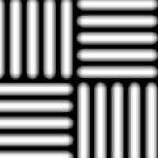

# Weave 1

<table>
<tr style="border: 0;">
<td style="border: 0;" valign="top">

{width="128px"}

## Weave 1

**In:** *Texture Generators**/Patterns*

**Simple**

</td>
<td style="border: 0;" valign="top">

## Description

Generates a simple weave pattern.

## Parameters

* **Tiling**: *1 - 16*  
  Sets the amount of times the result should tile.
* **Rotate 45 Degrees**: *False/True*
* **Non Square Expansion**: *False/True*  
  Enables compensation of squash and stretch with non-square ratios.

## Example Images

</td>
</tr>
</table>
