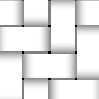

# Weave Generator

<table>
<tr style="border: 0;">
<td width="33.33%" style="border: 0;" valign="top">

{width="128px"}

<b>In:</b> Texture Generators &gt; Patterns

</td>
<td width="100.00%" style="border: 0;" valign="top">

## Description

This node generates a simple weave pattern with a few options. It allows for more control than the pre-defined weave patterns and presents a pattern that cannot be achieved with other nodes.

</td>
</tr>
</table>

## Parameters

|  |  |
|:---|:---|
| <b>Tile X</b> <i>1 - 20</i> | Sets how many blocks repeat on the X-axis. |
| <b>Tile Y</b> <i>1 - 20</i> | Set how many blocks repeat on the Y-axis. |
| <b>Shape</b> <i>0.0 - 1.0</i> | Sets curve height profile of the stitch. |
| <b>Weave</b> <i>1 - 10</i> | Sets how many stitches per block. |
| <b>Gap</b> <i>0.0 - 1.0</i> | Sets the gap between stitches on X- and Y-axis. |
| <b>Non Square Expansion</b> <i>False/True</i> | Enables compensation of squash and stretch with non-square ratios. |

## Examples

<table style="margin-top: 32px; margin-bottom: 32px">
    <tr style="border: 0">
        <td style="border: 0; background: transparent">
            
        </td>
    </tr>
</table>
