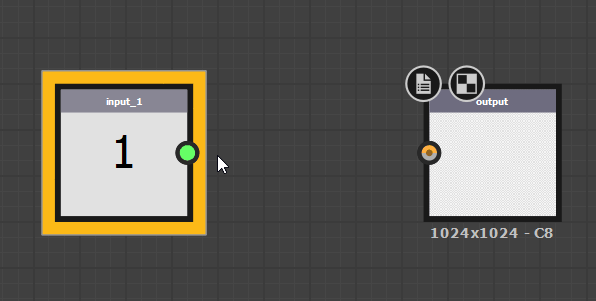

# Values in Substance graphs

Since the Introduction of the [Substance 3D Designer](https://www.adobe.com/products/substance3d-designer.html) Engine v7 in version 2019.1.0, it is now possible to process values in the Substance graph, and[ not just in functions](../../function-graphs/function-graphs.md). Value data is the same data used in Functions ( Integers, Floats and Booleans among others), making it distinctly different from Color or Grayscale image data, which represents pixel values for an entire image. Specifically, when mentioning Values data, this means *Integer 1, Integer 2, Integer 3 and Integer 4, Float 1, Float 2, Float 3 and Float 4 and Boolean*. Each has a distinct color coding, and are mostly not interchanged with each other.

There are a few usecases for this, such as:

* Returning and processing non-image data such as single value material properties or extra metadata. For example the IOR value of a material.
* Optimizing graph calculations that do not need to be calculated per pixel (an alternative to the [Pixel Processor](../nodes-reference-for-com/atomic-nodes/pixel-processor/pixel-processor.md)). For example a random solid color.
* Linking properties of one node to another by processing image data into values. For example the Minimum and Maximum values for an image to adjust Levels with.

## New Value nodes and inputs

Two new Atomic Nodes work with Values:

|  |  |
| --- | --- |
| 

  <b>&#91;Value Processor&#93;(../nodes-reference-for-com/atomic-nodes/value-processor/value-processor.md)</b> | The [Value Processor](../nodes-reference-for-com/atomic-nodes/value-processor/value-processor.md) takes Any number of Grayscale or Color Inputs and allows you to return a single Value from calculations based on these inputs. |
| 

  **[Value Input](../nodes-reference-for-com/atomic-nodes/input/input.md)** | The [Value Input ](../nodes-reference-for-com/atomic-nodes/input/input.md)allows you to create an input slot on sub-graphs that is explicitely defined as a Value. |

Additionally, other nodes deal with them in a specific way:

The [Output Node](../nodes-reference-for-com/atomic-nodes/output/output.md) automatically adjusts to become a Value Output if you plug a Value connection into it, just like it did before with Grayscale and Color.

{width="512px"}

There is a new tab on every single node ([Atomic ](../nodes-reference-for-com/atomic-nodes/atomic-nodes.md)and [Library](../nodes-reference-for-com/node-library/node-library.md)/Instance) that allows you to define Value inputs.

## Working with values

Making use of Values is slightly different from regular Substance graph work:

Value connections can only be made from a [Value Processor](../nodes-reference-for-com/atomic-nodes/value-processor/value-processor.md), from a [Value Input,](../nodes-reference-for-com/atomic-nodes/input/input.md) or from a [Sub-Graph](../creating-compositing-gra/graph-instances-sub-gra/graph-instances-sub-graphs.md). That actually means that a Value Processor is the only way to create a Value connection from scratch, there is no "Static Value" node or anything similar. Instead, Create a Value Processor, place a static Value and set it as output to achieve the same result.

Value Processor can only return a single Value, if you want to return multiple Values, or sets or Groups of Values, you will have to create a [Sub-Graph](../creating-compositing-gra/graph-instances-sub-gra/graph-instances-sub-graphs.md).

To highlight where Values are exposed or in use, any Node that has Value Inputs, or Value Outputs, is highlighted with a thick yellow border:

 