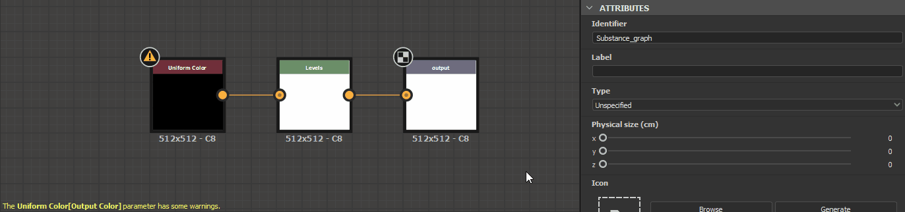

# Warnings in Substance graphs

This page lists warnings and errors messages which may be triggered by [Substance graphs](../../compositing-graphs/substance-compositing-graphs.md) in Substance 3D Designer, and offers common troubleshooting steps for each.

Warnings are displayed in the warning icon's tooltip for the graph resource in the [Explorer](https://helpx.adobe.com/substance-3d/unlisted/documentation/sddoc/the-explorer-129368147.html) panel, as well as in the bottom left corner of the [Graph view](../../interface/the-graph-view/the-graph-view.md) if the graph is loaded.

##  No output node defined

The graph does not have an [Output](../../compositing-graphs/nodes-reference-for-com/atomic-nodes/output/output.md) node.

** Solution**

Add one or more [Output](../../compositing-graphs/nodes-reference-for-com/atomic-nodes/output/output.md) nodes to the graph, and connect the output of the last node in a stream to it.

>[!NOTE]
>
> The graph templates available through the [New Substance graph dialog](https://helpx.adobe.com/substance-3d/unlisted/documentation/sddoc/create-a-graph-102400068.html) have preset Output nodes ready to be used.

{width="512px"}

###  The *&#91;x&#93;* parameter's function has some warnings

The [function graph](../../function-graphs/function-graphs.md) applied to the specified parameter of the specified node has at least one warning.  
The node parameter is specified between square brackets after the node label, following the template Node&#91;Parameter&#93;.

E.g. Uniform Color&#91;Output Color&#93;, Pixel Processor&#91;Per Pixel Function&#93;

** Solution**

Locate the node emitting the warning by its label and warning badge in the [Graph view](../../interface/the-graph-view/the-graph-view.md), then select it to display its properties in the [Properties](https://helpx.adobe.com/substance-3d/unlisted/documentation/sddoc/parameters-ui-129368153.html) panel. Find the parameter emitting the warning and open its function by clicking the **Edit function** button.

Then, assess the warning(s) listed in the bottom left corner of the Graph view and solve the issues. You may refer to the [Warnings in function graphs](../../function-graphs/warnings-function-graphs/warnings-in-function-graphs.md) page for troubleshooting warnings reported in function graphs.

###  The referenced data has some warnings

The resource referenced by a node has one or more warnings. Here are some nodes referencing a resource:

* A [graph instance](../../compositing-graphs/creating-compositing-gra/graph-instances-sub-gra/graph-instances-sub-graphs.md) node references a graph
* A [Bitmap](../../compositing-graphs/nodes-reference-for-com/atomic-nodes/bitmap/bitmap.md) node references a [Bitmap resource](../../resources/bitmap-resource/bitmap-resource.md)
* An [SVG](../../compositing-graphs/nodes-reference-for-com/atomic-nodes/svg/svg.md) node references an [SVG resource](../../resources/vector-graphics-svg-res/vector-graphics-svg-resource.md)
* A [Text](../../compositing-graphs/nodes-reference-for-com/atomic-nodes/text/text.md) node references a [Font resource](../../resources/font-resource/font-resource.md)

** Solution**

In the [Explorer](https://helpx.adobe.com/substance-3d/unlisted/documentation/sddoc/the-explorer-129368147.html) panel, find the referenced resource and troubleshoot all warnings raised by the resource:

* For graphs, refer to other items in this page
* For any other type of resource, refer to the [Warnings from dependencies](../../resources/warnings-from-dep/warnings-from-dependencies.md) page

###  Reference resource not found

The resource referenced by a node was not found at the path saved in the[Substance 3D](https://www.adobe.com/products/substance3d/3d-augmented-reality.html) file (SBS). Here are some nodes referencing a resource:

* A [graph instance](../../compositing-graphs/creating-compositing-gra/graph-instances-sub-gra/graph-instances-sub-graphs.md) node references a graph
* A [Bitmap](../../compositing-graphs/nodes-reference-for-com/atomic-nodes/bitmap/bitmap.md) node references a [Bitmap resource](../../resources/bitmap-resource/bitmap-resource.md)
* An [SVG](../../compositing-graphs/nodes-reference-for-com/atomic-nodes/svg/svg.md) node references an [SVG resource](../../resources/vector-graphics-svg-res/vector-graphics-svg-resource.md)
* A [Text](../../compositing-graphs/nodes-reference-for-com/atomic-nodes/text/text.md) node references a [Font resource](../../resources/font-resource/font-resource.md)

** Solution**

For [graph instance](../../compositing-graphs/creating-compositing-gra/graph-instances-sub-gra/graph-instances-sub-graphs.md) nodes

Check that the source graph exists in the package located at the path saved in their **Package** attribute.  
If it does not, delete the instance node and replace it with an instance node referencing a valid package. Alternatively, you may recreate the package and graph referenced by the instance node, then reload the host package by clicking RMB on it in the [Explorer](https://helpx.adobe.com/substance-3d/unlisted/documentation/sddoc/the-explorer-129368147.html) panel and selecting the **Reload** option in the contextual menu.

For [Bitmap](../../compositing-graphs/nodes-reference-for-com/atomic-nodes/bitmap/bitmap.md), [SVG](../../compositing-graphs/nodes-reference-for-com/atomic-nodes/svg/svg.md) or [Text](../../compositing-graphs/nodes-reference-for-com/atomic-nodes/text/text.md) nodes

Find the referenced resources in the [Explorer](https://helpx.adobe.com/substance-3d/unlisted/documentation/sddoc/the-explorer-129368147.html) panel and check they exist at the location saved in their **File Path** attribute.  
If they do not, click RMB on the resource item in the Explorer and select the **Relocate...** option in the contextual menu to set a new valid target file for that resource.

###  Text node uses invalid font

A [Text](../../compositing-graphs/nodes-reference-for-com/atomic-nodes/text/text.md) node references a font which cannot be loaded or parsed correctly.

<b>!&#91;(tick)&#93;(../../assets/check.svg) Solution</b>

Select the [Text](../../compositing-graphs/nodes-reference-for-com/atomic-nodes/text/text.md) node and make a note of the value of its <b>Font</b> property. Find the source file for that font on your system and make sure it is *healthy*, e.g. by using it in another application such as a text editor. Replace the font by a healthy font file as necessary, or switch the Text node to another font.
