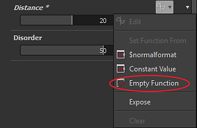
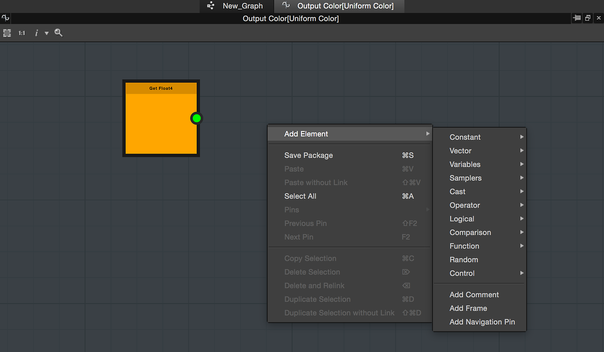

# Create and edit a function

## Create a function

In order to create a function, you just need to click on the function icon  and choose "**Empty Function**".

## Edit a function

Once a function has been created, you can modify it by clicking the function icon again, or by choosing Edit in the drop down list.

You will then enter in the function mode of the graph.

## The function graph

The function graph works in the same way as other graphs types in Designer: with a node editor.

## Create nodes

You can create nodes by right-clicking in the graph and choosing "Add element", or by pressing space bar:

{width="600px"}

## Set an output

Contrary to the Substance graph, the function does not have "Output" node, you have to specify which node in the graph is the function output.

You can set an output by right-clicking on a node and choosing <b>&quot;Set as output node&quot;.</b>

The node set as an output will become yellow.

>[!NOTE]
>
> **Output type**
> 
> The node that you want to set as output, has to hold the same value type as the parameter it controls. If not, the option "Set as Output Node" will be Greyed out.

>[!WARNING]
>
> A function must have an output in order to work. You will see a warning in your graph if your function does not have any output set.
