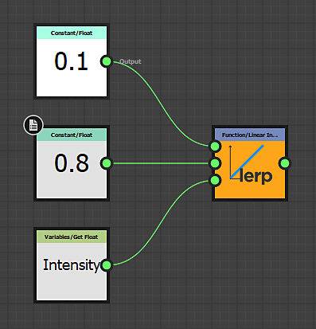

# Substance function graphs

<table>
<tr style="border: 0;">
<td style="border: 0;" valign="top">

[{width="120px"}](https://substance3d.adobe.com/)

</td>
<td style="border: 0;" valign="top">

[Substance function graphs](https://substance3d.adobe.com/) <b>process single values</b> (integers, floats, vectors) instead of image data (whole sets of pixels). Functions are also Graphs with node networks, but the [Nodes used ](nodes-reference-for-fun/atomic-function-nodes/function-nodes/function-nodes.md)and the interface is different from [regular Substance graphs](../compositing-graphs/substance-compositing-graphs.md). The workflow is completely based on <b>mathematical operations</b> and does not show any image preview thumbnails, making it a <b>much more advanced way to work</b> with Substance 3D Designer.

Functions can be used in many different contexts, the main ones being to modify the behaviour of [an exposed Parameter](../compositing-graphs/manage-parameters/exposing-a-parameter/exposing-a-parameter.md), to author the behaviour of [Pixel Processors](../compositing-graphs/nodes-reference-for-com/atomic-nodes/pixel-processor/pixel-processor.md) or [FX-Maps](../compositing-graphs/nodes-reference-for-com/atomic-nodes/fx-map/fx-map.md) and to to use [Values in a Graph.](https://helpx.adobe.com/substance-3d/unlisted/documentation/sddoc/values-in-substance-3d-graphs-180192235.html)

</td>
</tr>
</table>

## Examples

Below are some examples from common usecases for Functions.

### Simple Function

A simple function in the context of an exposed parameter. It gets an input float value called "Intensity" that is determined to go from 0 to 1 (a range easy to understand) and remaps it to a set range of 0.1 - 0.8. That means if the user sets Intensity ot 0, internally 0.1 will be used, if the Ui is set to 1, 0.8 wil be used, and any value in between will be interpolated linearly. This type of function is something commonly used when [exposing parameters](../compositing-graphs/manage-parameters/exposing-a-parameter/exposing-a-parameter.md), but using custom functions.

This function could also be written as *lerp(0.1, 0.8, Intensity)* in a pseudocode similar to HLSL or GLSL.

### Advanced Function

{width="545px"}

This advanced Function shows the inner workings of a [Pixel Processor](../compositing-graphs/nodes-reference-for-com/atomic-nodes/pixel-processor/pixel-processor.md) meant for adjusting the Hue of a color map input based on the intensity of a second grayscale mask input.

It samples both inputs with the system "$pos" variable, then strips the Alpha, converts the color value to HSL and modifies the Hue component by multiplying it with the sampled grayscale value. Afterwards it re-assembles the vector, converts the HSL back to RGB and adds the Alpha back in for the final output.

in pseudo-code this would be a much more complicated function that would not fit on a single line.
