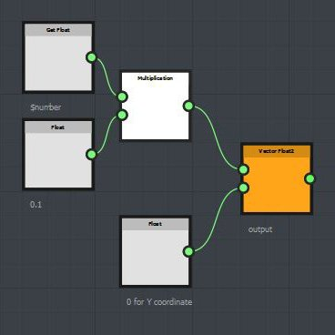

# Iterate and $number variable

The Iterate node will render the nodes connected to the right output the amount of time specified by the Iterations value.

| 

 | 1 iteration: the gaussian pattern is rendered once |
| --- | --- |
| 

 | 10 iterations: the gaussian pattern is rendered 10 times at the same place |

When using an Iterate node, you can use the $number variable to get the current iteration value. $number is a float value and starts at 0.

<table>
<tr style="border: 0;">
<td style="border: 0;" valign="top">

{width="300px"}

</td>
<td style="border: 0;" valign="top">

{width="300px"}

</td>
</tr>
</table>

This function, set in the Pattern Offset parameter, will be executed 10 times, one for each pattern.

The first pattern has a $number value equal to 0 and is then rendered at the (0, 0) coordinate. The second pattern has a $number value equal to 1 and is then rendered at the (0.1, 0) coordinate (1 x 0.1 = 0.1) and so on for the next patterns.

Download sample: [iterate\_node.sbs](https://helpx.adobe.com/content/dam/help/en/substance-3d/documentation/sddoc/files/102400023/102367299/1/1423458106000/iterate-node.sbs)
