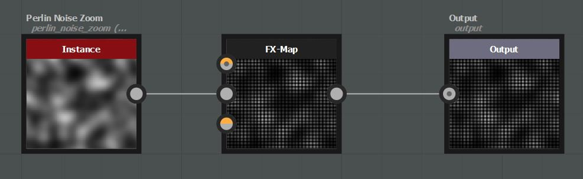
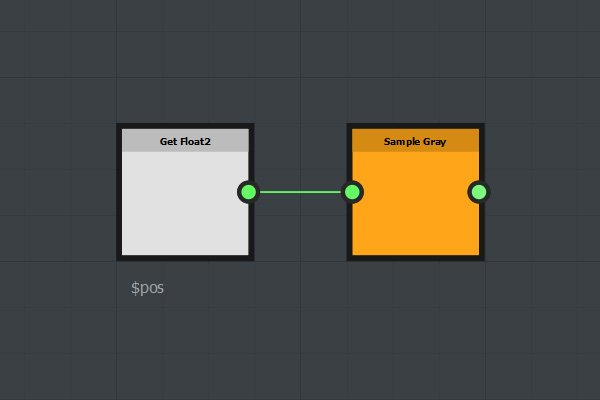
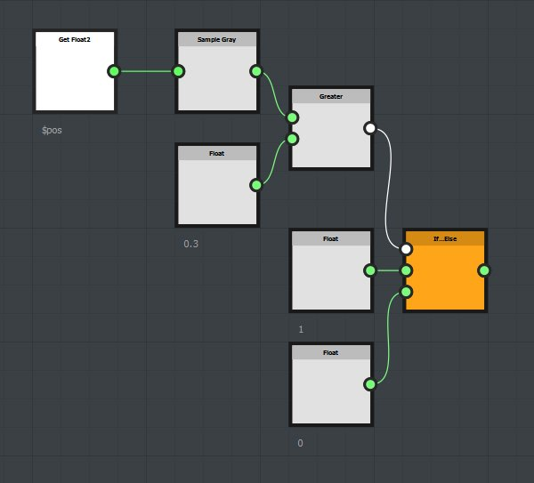

# Using the Sampler nodes

The sampler node can be used to sample pixel values in an image input plugged to the fx-map node. The sampled values can then be used to drive any parameters using functions.

## Simple Example

In this example a chain of quadrant nodes have been created to generate a grid of pattern. A function is created in the Opacity/Luminance parameter of the last quadrant.

{width="300px"}{width="300px"}

The Sample node takes a float2 input as the sampling coordinates (x, y). In this example we used the $pos variable: for each pattern, the pixel value is sampled at the pattern position in the first image input plugged to the FxMap node.

The Sample Gray node returns a float1 value in the 0, 1 range.

The Sample Color node returns a float4 (rgba) value in the 0, 1 range.

## Advanced Example

Here, we compare the sampled value to a constant (0.3). If the sampled value is greater than 0.3 the function returns 1, else, it returns 0.

{width="300px"}{width="300px"}

## Download sample

[{width="64px"}](https://shared-assets.adobe.com/link/d5f9adf3-0bb5-49a1-4eb9-a0506d4f3f32)
