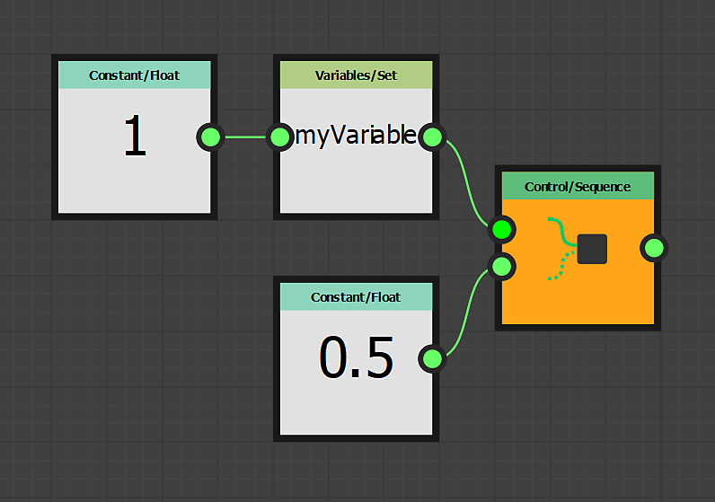

# Using the Set/Sequence nodes

This page describes the **Set** and **Sequence** nodes, and provides an example use case in the context of **FX-Maps**.

<table>
<tr style="border: 0;">
<td style="border: 0;" valign="top">

## Overview

While working with functions in <b>FX-Maps</b>, you will occasionally be in situations where you want to output a value from a parameter's *[Substance function graph](../../../the-function-graph/the-function-graph.md)*, so you can *use it into another.* But by default a Substance function graph only outputs *one* value: the one which drives the related parameter.

</td>
<td style="border: 0;" valign="top">

</td>
</tr>
</table>

In this case, you may use the combination of <b>Set</b> and <b>Sequence</b> nodes, which will allow you to control variables across a single or multiple functions.

This process involves two steps:

1. The <b>Set</b> node will let you create a new variable so you can call it somewhere else and assign a value to it.
1. The <b>Sequence</b> node is used to execute the logic in step 1 in its entirety, *before executing another branch* of the graph – e.g. the logic actually involved in outputting the expected value for the current graph

<table>
<tr style="border: 0;">
<td width="100.00%" style="border: 0;" valign="top">

## The Set node

The <b>Set</b> node lets you set a new variable and assign it the type and value connected to the node's *input*.

The *name* of the variable is input by the user in the node's properties.

By default, the variable set by this node is *only* accessible within the scope of the *parent* of this Substance function graph – e.g. the node which hosts the parameter defined by the function.

</td>
<td width="25.00%" style="border: 0;" valign="top">

</td>
</tr>
</table>

<table>
<tr style="border: 0;">
<td style="border: 0;" valign="top">

In this example, the variable name has been set to **`myVariable`** and its value is **1**.

</td>
<td style="border: 0;" valign="top">

</td>
</tr>
</table>

<table>
<tr style="border: 0;">
<td width="100.00%" style="border: 0;" valign="top">

## The Sequence node

The <b>Sequence</b> node gives you control over the *execution flow* of Substance function graphs, by making sure the *first branch is fully executed before the second branch*.

The output of the *second branch* is then passed to the node's output.

</td>
<td width="25.00%" style="border: 0;" valign="top">

</td>
</tr>
</table>

<table>
<tr style="border: 0;">
<td style="border: 0;" valign="top">

In this example, the <b>Sequence</b> node is set as the output of the graph. The output of the function is thus the <b>0.5</b> value output by the <b>Float</b> node.

However, before that happens the `<b>myVariable</b>` variable is set with a float value of <b>1.0</b>. This variable may then be used *elsewhere* in the context of the node.

</td>
<td style="border: 0;" valign="top">

</td>
</tr>
</table>

**Sequence** nodes can be *chained* to control the graph's execution flow.

For instance, you may *set* a variable first, *update* its value at a later point then *read* its final value, while making sure these actions occur *in a specific order*.

## Variable visibility

Be aware that a declared variable is *not* accessible from anywhere!  
While a variable declared at a parent level can be accessible at child levels, the contrary is *not true*.

Thus, variables set in the node are *not* accessible at the graph level, while variables set at the graph's level *can* be accessed in its node's parameter functions.

For instance, this rule is at the core of *exposing a parameter*, for exposing actually involves these steps:

1. Creating a graph input parameter
1. Accessing it in the parameter's Substance function graph
1. Setting its value as the function's output

Let us build a small example: imagine that we want a <b>Quadrant</b> node's <b>Rotation</b> value to be influenced by the <b>Color/Luminosity</b> value: the brighter the luminosity, the more rotation.

<table>
<tr style="border: 0;">
<td style="border: 0;" valign="top">

What we will do is to make all the computation in the <b>Color/Luminosity</b> parameter function. This parameter will be computed *first* thus any variable set in it will be available to the other node parameters.

</td>
<td style="border: 0;" valign="top">

</td>
</tr>
</table>

<table>
<tr style="border: 0;">
<td style="border: 0;" valign="top">

Our function is going to be simple: the luminosity will be a random value between **0** and **1**, this value will be stored into the `myRotation` variable, then we set the value as the function's output.

This means the **Color/Luminosity** parameter's value will be random *and* be stored in the `myRotation` variable.

Note that the **Position** property is already defined by a random value, and an **Iterate** node is used to get multiple randomly placed patterns.

</td>
<td style="border: 0;" valign="top">

</td>
</tr>
</table>

<table>
<tr style="border: 0;">
<td style="border: 0;" valign="top">

Now that the `myRotation` variable exists and has a value, let us access the Substance function graph of the <b>Pattern Rotation</b> property.

</td>
<td style="border: 0;" valign="top">

</td>
</tr>
</table>

<table>
<tr style="border: 0;">
<td width="100.00%" style="border: 0;" valign="top">

In the function, we read the value of the `myRotation` parameter using a **Get Float** node – we know the variable contains a float value – and set it as the function's output.

</td>
<td width="25.00%" style="border: 0;" valign="top">

</td>
</tr>
</table>

The luminosity now also controls the rotation.

